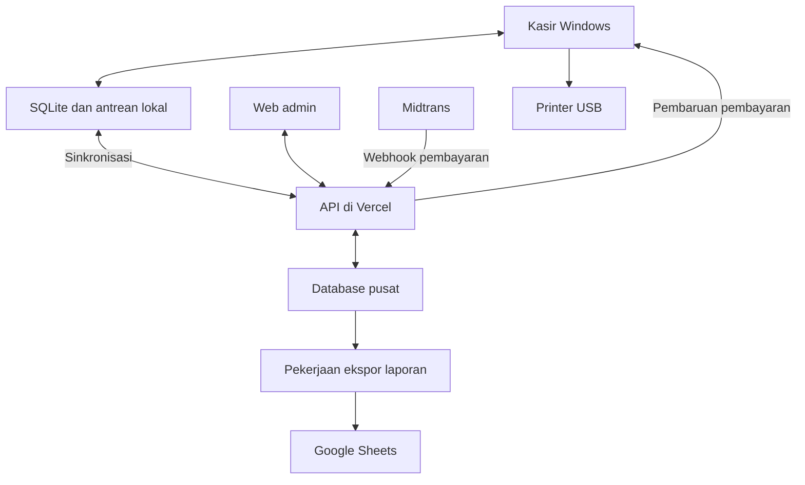
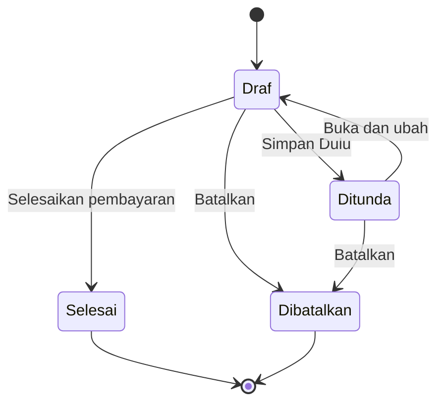

# Blueprint Fungsional Aplikasi Kasir Wedangan

**Versi:** 1.1 — fondasi perencanaan dan penyesuaian urutan validasi\
**Tanggal penyusunan:** 24 September 2026  
**Bahasa antarmuka:** Bahasa Indonesia  
**Target:** satu kedai, satu penjual merangkap kasir, satu laptop Windows touchscreen  
**Jenis dokumen:** spesifikasi fungsional dan rancangan perilaku; tidak berisi implementasi kode  
**Nama usaha sementara:** Wedangan dan Aneka Nasi Sayur

Dokumen ini menggabungkan seluruh kebutuhan yang dibahas, termasuk perubahan terakhir tentang QRIS statis, notifikasi pasif, web admin di Vercel, dan printer OKAY 58D. Isinya menjadi acuan bersama untuk desain, pembangunan, dan pengujian berikutnya. Angka dummy, target kinerja, dan keputusan yang belum diverifikasi tidak dinyatakan sebagai fakta operasional klien.

## Pembaruan keputusan — 24 September 2026

Laptop pengguna untuk mencoba preview saat ini **non-touchscreen**. Pengguna sudah puas dengan kecepatan aplikasi dan meminta kenyamanan UI/UX ditingkatkan. Target antarmuka besar, navbar atas, dan dukungan sentuh tetap menjadi rancangan; penilaian awal dilakukan dengan mouse/touchpad serta keyboard pada perangkat yang tersedia.

Printer belum tersedia dan akun merchant belum dibuat karena pemilik belum tersedia. Sesuai keputusan pengguna, uji touchscreen nyata, printer fisik, serta onboarding dan uji akun merchant asli dipindahkan ke **milestone penutup M6**. Pengembangan fungsi, laporan, dan UI/UX tetap berjalan; simulasi perangkat lunak diberi label uji. Ketiga pengujian asli tetap wajib diselesaikan sebelum operasional produksi. Rencana pelaksanaan aktif ada di [MILESTONES.md](MILESTONES.md).

## Daftar isi

1. [Tujuan dan konteks usaha](#1-tujuan-dan-konteks-usaha)
2. [Kesepakatan dan status keputusan](#2-kesepakatan-dan-status-keputusan)
3. [Pengguna dan hak akses](#3-pengguna-dan-hak-akses)
4. [Komponen sistem dan arah teknologi](#4-komponen-sistem-dan-arah-teknologi)
5. [Cakupan versi pertama](#5-cakupan-versi-pertama)
6. [Katalog menu dan data dummy](#6-katalog-menu-dan-data-dummy)
7. [Prinsip UI dan peta layar](#7-prinsip-ui-dan-peta-layar)
8. [Siklus operasional sehari-hari](#8-siklus-operasional-sehari-hari)
9. [Pesanan dan pemisahan status](#9-pesanan-dan-pemisahan-status)
10. [Pesanan ditunda dan perubahan pesanan](#10-pesanan-ditunda-dan-perubahan-pesanan)
11. [Pembayaran tunai](#11-pembayaran-tunai)
12. [QRIS statis Midtrans dan notifikasi](#12-qris-statis-midtrans-dan-notifikasi)
13. [Pencocokan pembayaran dan pencairan](#13-pencocokan-pembayaran-dan-pencairan)
14. [Pembatalan dan pengembalian uang](#14-pembatalan-dan-pengembalian-uang)
15. [Printer dan struk](#15-printer-dan-struk)
16. [Web admin](#16-web-admin)
17. [Perubahan harga dan penerbitan katalog](#17-perubahan-harga-dan-penerbitan-katalog)
18. [Penyimpanan lokal dan sinkronisasi](#18-penyimpanan-lokal-dan-sinkronisasi)
19. [Model informasi fungsional](#19-model-informasi-fungsional)
20. [Aturan angka dan laporan keuangan](#20-aturan-angka-dan-laporan-keuangan)
21. [Rancangan Google Sheets dan ekspor](#21-rancangan-google-sheets-dan-ekspor)
22. [Akses, cadangan, dan pemeliharaan](#22-akses-cadangan-dan-pemeliharaan)
23. [Target kualitas dan aksesibilitas](#23-target-kualitas-dan-aksesibilitas)
24. [Penanganan kegagalan dan kondisi khusus](#24-penanganan-kegagalan-dan-kondisi-khusus)
25. [Skenario penerimaan](#25-skenario-penerimaan)
26. [Tahap pengerjaan setelah blueprint](#26-tahap-pengerjaan-setelah-blueprint)
27. [Daftar keputusan terbuka](#27-daftar-keputusan-terbuka)
28. [Aturan yang wajib dipertahankan](#28-aturan-yang-wajib-dipertahankan)
29. [Glosarium](#29-glosarium)
30. [Sumber dan batas verifikasi](#30-sumber-dan-batas-verifikasi)

## 1. Tujuan dan konteks usaha

### 1.1 Gambaran usaha

Usaha berupa kedai/gerobak dengan konsep angkringan yang juga menyediakan nasi dan lauk seperti warteg. Pelanggan memilih makanan; penjual menyiapkan makanan sekaligus mencatatnya melalui aplikasi kasir. Tidak ada dapur terpisah, petugas dapur, maupun kebutuhan mengirim tiket pesanan ke dapur.

Satu laptop Windows touchscreen dipakai oleh satu penjual. Pengguna utama merupakan orang tua atau pengguna awam teknologi. Antarmuka harus mudah dibaca, mudah disentuh, menggunakan istilah sehari-hari, dan tidak menuntut perhatian terus-menerus ketika penjual sedang melayani makanan.

Pembayaran pada dasarnya dilakukan di awal. Pengecualian yang diperlukan adalah menyimpan pesanan sementara, misalnya pelanggan menunggu teman yang akan menambah makanan atau membayarkan seluruh pesanan. Tambahan makanan setelah pembayaran selesai dibuat sebagai pesanan baru.

### 1.2 Hasil yang ingin dicapai

- Memilih makanan melalui gambar besar dengan tanggapan yang terasa langsung.
- Mengurangi salah jumlah, salah total, dan salah menghitung kembalian.
- Menyimpan pesanan sementara tanpa menghalangi pelanggan berikutnya.
- Menerima tunai dan QRIS statis; QRIS dicetak dan dipajang di gerobak.
- Memberikan notifikasi suara serta popup kecil di laptop untuk pembayaran QRIS yang terverifikasi oleh penyedia.
- Tetap dapat berjualan tunai ketika internet terputus.
- Menyimpan transaksi lokal, mengirimkannya ke database online, dan menyediakan laporan Google Sheets.
- Mengelola menu, foto, kategori, harga, dan laporan melalui web admin.
- Memiliki catatan transaksi, biaya, refund, kas, dan pencairan yang dapat ditelusuri.
- Mencetak struk 58 mm dan menyediakan cetak ulang tanpa menggandakan transaksi.

### 1.3 Prioritas produk

Urutan prioritas: kebenaran transaksi dan ketahanan data; kemudahan penggunaan; kecepatan interaksi; keterbacaan; keandalan integrasi; kelengkapan laporan; kemudian penyempurnaan visual. Tampilan tetap harus rapi dan menarik, tetapi animasi atau dekorasi tidak boleh menunda pekerjaan kasir.

## 2. Kesepakatan dan status keputusan

### 2.1 Penanda status

- **D — Disepakati:** dinyatakan langsung oleh pengguna/klien dalam diskusi, termasuk koreksi terakhir.
- **R — Rancangan awal:** rekomendasi yang dijadikan baseline dokumen; dapat disesuaikan saat peninjauan.
- **V — Perlu verifikasi:** bergantung pada akun, perangkat, penyedia, atau kebijakan usaha yang belum diketahui.

Detail yang tidak memiliki penanda tersendiri merupakan rancangan perilaku yang diusulkan untuk memenuhi keputusan D. Dokumen ini tidak menganggap seluruh usulan terdahulu sudah mendapat persetujuan eksplisit.

### 2.2 Register keputusan

| ID | Keputusan | Status |
| --- | --- | --- |
| D01 | Satu kedai, satu penjual merangkap kasir, satu laptop Windows touchscreen | D |
| D02 | Tidak ada alur dapur atau perangkat dapur tambahan | D |
| D03 | Navbar utama berada di atas; gambar, tulisan, dan tombol diperbesar | D |
| D04 | Bahasa UI sederhana, cocok bagi orang tua dan pengguna awam | D |
| D05 | Kategori awal Nasi, Lauk, Sundukan, dan Minuman | D |
| D06 | Ada paket nasi, nasi saja, serta lauk yang dapat dijual satuan | D |
| D07 | Nama dan harga awal boleh dummy, lalu dikelola lewat admin | D |
| D08 | Metode pembayaran hanya tunai dan QRIS untuk cakupan awal | D |
| D09 | Pembayaran umumnya di awal; pesanan dapat disimpan sementara | D |
| D10 | Pesanan yang sudah dibayar tidak ditambah; tambahan menjadi pesanan baru | D |
| D11 | QRIS statis dicetak; pelanggan tidak perlu melihat atau memutar laptop | D |
| D12 | Preferensi integrasi melalui Midtrans apabila notifikasi aplikasi tersedia | D; kemampuan produk didukung dokumentasi, akun tetap V |
| D13 | Popup QRIS hanya menampilkan pembayaran diterima, nominal, dan jam | D |
| D14 | Popup tidak memiliki tombol pencocokan/konfirmasi dan tidak mengganggu input | D |
| D15 | Ada notifikasi suara pembayaran pada laptop | D |
| D16 | Penyelesaian pesanan dilakukan melalui tombol biasa di halaman pembayaran | R dari penjelasan terakhir; tidak menambah dialog wajib |
| D17 | Data disimpan di laptop sebelum dikirim ke sistem online | D |
| D18 | Database online dan Google Sheets sama-sama diperlukan | D |
| D19 | Web admin dapat menambah menu dan mengubah harga | D |
| D20 | Web admin diarahkan ke Vercel; pengguna tidak memiliki VPS | D |
| D21 | Bahasa web admin tidak wajib C# | D |
| D22 | Target printer adalah OKAY 58D pada gambar, kertas 58 mm | D; driver dan protokol V |
| D23 | Rekening pencairan yang diinginkan adalah SeaBank | D sebagai keinginan; kelayakan akun V |
| D24 | Pengguna/pengembang menangani pemeliharaan teknis | D |
| D25 | Laporan mencakup detail keuangan sampai biaya QRIS | D |
| D26 | Tarif 0,7% tidak dihardcode; tarif aktual mengikuti merchant | R berdasarkan sumber resmi |
| D27 | Refund dicatat tanpa menghapus transaksi asal | R; kebijakan refund klien V |
| D28 | C# + WPF, Next.js/TypeScript, dan Supabase menjadi arah teknologi | R |
| D29 | Stok bahan/resep tidak masuk versi awal; tersedia/habis tetap disediakan | R |
| D30 | Spesifikasi laptop bukan prasyarat menyusun blueprint | D; kompatibilitas diuji kemudian |
| D31 | Sesi buka/tutup kas dan pencocokan pembayaran dikelola secara jelas | R |
| D32 | Tahap sekarang hanya blueprint, belum implementasi | D |

### 2.3 Keputusan lama yang digantikan

1. QRIS dinamis pada layar laptop diganti dengan QRIS statis cetak sebagai alur utama.
2. Tombol popup “Gunakan untuk pesanan ini” dihapus. Tidak ada pencocokan wajib pada popup maupun dialog pengganti ketika notifikasi datang.
3. Server ASP.NET Core terpisah diganti dengan usulan API Next.js di Vercel agar sesuai arah hosting. Aplikasi kasir tetap C#.
4. Rekomendasi printer 80 mm diganti dengan target printer 58 mm yang dipilih pengguna.
5. Pertanyaan detail spesifikasi laptop ditunda ke pengujian perangkat.
6. Penghapusan transaksi sebagai cara refund diganti dengan pencatatan pengembalian uang yang mempertahankan jejak transaksi.
7. Gagasan dua pengiriman langsung dari laptop ditata menjadi lokal → server → spreadsheet. Tiga tempat penyimpanan tetap ada; Sheets merupakan keluaran laporan, bukan cadangan database lengkap.

## 3. Pengguna dan hak akses

| Peran | Tanggung jawab | Akses utama |
| --- | --- | --- |
| Penjual/kasir | Melayani, mencatat makanan, menerima pembayaran, memberikan kembalian, mencetak struk | Aplikasi Windows |
| Pemilik/pengelola usaha | Menetapkan menu dan harga, meninjau kas/laporan, menyetujui refund | Web admin dan fungsi pemilik pada kasir |
| Pengelola teknis | Instalasi, pembaruan, pemantauan integrasi, cadangan, dukungan | Akses teknis yang diberikan pemilik |
| Pelanggan | Memilih makanan dan membayar tunai atau scan QRIS cetak | Tidak memiliki akun aplikasi |

Rancangan hak akses awal:

| Tindakan | Kasir | Pemilik | Pengelola teknis |
| --- | --- | --- | --- |
| Membuat, mengubah, dan menyimpan pesanan belum lunas | Ya | Ya | Hanya bila juga diberi peran kasir |
| Menyelesaikan pembayaran dan mencetak struk | Ya | Ya | Bukan hak otomatis dari akses teknis |
| Membatalkan pesanan belum lunas | Ya, dengan alasan singkat | Ya | Sesuai peran |
| Mengubah harga/menu permanen | Tidak | Ya | Bila didelegasikan |
| Menandai menu habis/tersedia | Ya, sebagai usulan operasional | Ya | Bila didelegasikan |
| Mengajukan/menjalankan refund | Tidak secara bebas; akses pemilik diperlukan | Ya, mengikuti kebijakan | Bukan hak otomatis |
| Mengubah pasangan pembayaran saat rekonsiliasi | Tidak diwajibkan di kasir | Ya, dengan catatan | Bila didelegasikan |
| Mengubah rekening pencairan | Tidak | Melalui pengaturan penyedia dan verifikasi | Membantu, tanpa kepemilikan otomatis |
| Mengelola kredensial dan integrasi | Tidak | Mengendalikan pemberian akses | Ya, sesuai mandat |

Satu orang dapat memegang beberapa peran, tetapi tindakan tetap mencatat identitas pelakunya. Login/PIN bukan langkah berulang pada setiap penjualan biasa. Kepemilikan akun merchant, rekening, domain, dan layanan harus ditentukan sebelum produksi; pemeliharaan oleh pengembang tidak otomatis memindahkan kepemilikan dana atau data.

## 4. Komponen sistem dan arah teknologi

### 4.1 Susunan awal

| Komponen | Teknologi usulan | Fungsi |
| --- | --- | --- |
| Kasir desktop | C# + WPF pada .NET LTS yang didukung; kandidat saat penyusunan .NET 10 | UI sentuh, transaksi, cetak, suara, data lokal |
| Database lokal | SQLite | Katalog lokal, pesanan, catatan pembayaran, sesi kas, antrean kirim/cetak |
| Admin dan API | Next.js + TypeScript di Vercel | Pengelolaan usaha, sinkronisasi, penerimaan webhook |
| Database pusat | PostgreSQL terkelola, kandidat Supabase | Data pusat, pembayaran penyedia, laporan, audit |
| Penyimpanan gambar | Supabase Storage atau layanan objek terkelola setara | Foto katalog dan aset yang diterbitkan |
| Penyedia pembayaran | GoPay Static QRIS melalui Midtrans | Pembayaran dari QR cetak dan pemberitahuan transaksi |
| Spreadsheet | Google Sheets | Proyeksi laporan untuk pemilik |
| Printer | OKAY 58D, sambungan USB sebagai pilihan pertama | Struk thermal 58 mm |

WPF dipilih sebagai arah praktis untuk Windows, bukan klaim bahwa ia selalu tercepat. Microsoft merekomendasikan WinUI 3 untuk aplikasi native Windows baru; WPF tetap menjadi pilihan yang dapat dipertimbangkan untuk kebutuhan desktop ini. Penilaian final dilakukan melalui prototipe pada perangkat sasaran. [S1][S2][S3]

### 4.2 Hubungan komponen

Panah pembaruan pembayaran menunjukkan aliran informasi, bukan janji sambungan push permanen. Rancangan awal memakai pengambilan pembaruan berkala oleh laptop. Tidak diperlukan port publik pada laptop.

### 4.3 Batas arsitektur

- Operasi memilih menu, mengubah jumlah, menghitung total, dan menyimpan tunai tidak menunggu server.
- Kunci rahasia Midtrans dan akses administratif database tetap berada pada lingkungan server yang sesuai.
- Database pusat menggunakan penyimpanan persisten; berkas sementara fungsi Vercel tidak dijadikan database transaksi.
- Pekerjaan ekspor yang gagal tetap tercatat dan dapat dicoba lagi. Pekerjaan penting tidak hanya hidup dalam proses yang akan berakhir setelah request selesai.
- Tidak diperlukan VPS yang dikelola sendiri untuk rancangan ini. Vercel, database, dan penyimpanan objek tetap merupakan layanan dengan kuota dan biaya.
- Vercel mendukung halaman dan endpoint API dalam proyek Next.js; paket Hobby memiliki pembatasan penggunaan pribadi nonkomersial. Paket produksi harus sesuai penggunaan usaha. [S8][S9][S10]
- Mekanisme penjadwal/antrean terkelola untuk pekerjaan berulang dipilih pada rancangan teknis, mengikuti paket hosting. Tidak diasumsikan ada proses tanpa batas waktu.

## 5. Cakupan versi pertama

### 5.1 Termasuk

- Katalog foto besar dengan empat kategori awal dan produk paket/satuan.
- Keranjang pesanan, perhitungan jumlah dan total, catatan singkat opsional.
- Pesanan ditunda, dibuka kembali, diubah, atau dibatalkan.
- Pembayaran tunai dan perhitungan kembalian.
- Pencatatan QRIS oleh kasir serta penerimaan transaksi Midtrans secara terpisah.
- Suara dan popup pasif pembayaran QRIS.
- Penyelesaian pesanan, struk otomatis sesudah simpan berhasil, dan cetak ulang.
- Riwayat transaksi dan pencarian nomor pesanan.
- Sesi buka/tutup kas, modal awal, kas masuk/keluar, dan selisih kas sebagai baseline usulan.
- Web admin menu, foto, kategori, harga, publikasi, laporan, dan pemeriksaan pembayaran.
- Tanda habis/tersedia tanpa menghitung stok bahan.
- Penyimpanan lokal, pemulihan sesi, sinkronisasi, dan indikator status yang sederhana.
- Laporan terperinci, ekspor Sheets, pencatatan biaya dan pencairan.
- Pencatatan pembatalan/refund, audit, dan cadangan.

### 5.2 Tidak menjadi kebutuhan versi awal

| Fitur | Batasan |
| --- | --- |
| Banyak cabang/banyak kasir serentak | Identitas perangkat tetap disiapkan; sinkronisasi multi-kasir bukan janji versi pertama |
| Dapur, kitchen display, tiket dapur | Tidak sesuai operasi yang dijelaskan |
| Android/iPad atau pemesanan pelanggan mandiri | Tidak diminta |
| QRIS dinamis sebagai alur utama | Digantikan oleh QRIS statis cetak |
| Transfer bank manual sebagai metode kasir | Tidak disediakan pada versi pertama |
| Utang pelanggan/cicilan | Pesanan ditunda tidak otomatis berarti fasilitas kredit |
| Split bill/patungan/pembayaran campuran normal | Ditunda; kekurangan pembayaran menjadi kasus pengecualian |
| Penggabungan dua pesanan menjadi satu | Belum diperlukan; gunakan satu pesanan tersimpan untuk teman yang menyusul |
| Stok resep, pengadaan, pemasok, dan HPP otomatis | Belum ada data dan kebutuhan yang disepakati |
| Loyalitas, voucher, promosi, delivery marketplace | Pengembangan berikutnya jika dibutuhkan |
| Laba bersih lengkap atau pembukuan formal | Tidak diklaim tanpa data biaya dan kebijakan akuntansi yang lengkap |

Refund sebagian, diskon, pajak usaha, dan service charge memerlukan keputusan tersendiri. Struktur informasi tidak boleh menghalangi penambahan di masa depan, tetapi fitur tersebut tidak diam-diam dianggap sudah aktif.

## 6. Katalog menu dan data dummy

### 6.1 Kategori

| Kategori | Isi | Aturan tampilan |
| --- | --- | --- |
| Nasi | Nasi putih dan paket nasi dengan lauk | Nama paket menyebut lauk; gambar membedakan nasi saja dan paket |
| Lauk | Lauk satuan dan gorengan | Bandeng/telur/ayam tetap dapat dibeli tanpa nasi |
| Sundukan | Makanan tusuk/sate | Nama lokal dipertahankan agar familiar |
| Minuman | Minuman panas/dingin | Varian awal menjadi kartu terpisah untuk mengurangi dialog pilihan |

Kategori dapat diubah dari admin. Empat kategori ini merupakan susunan awal, bukan batas permanen database.

### 6.2 Daftar dummy

**Seluruh harga di tabel ini merupakan dummy untuk desain dan uji, bukan harga yang telah disetujui klien.**

| Kode contoh | Kategori | Nama produk | Harga dummy | Bentuk |
| --- | --- | --- | ---: | --- |
| NAS-001 | Nasi | Nasi Putih | Rp5.000 | Satuan |
| NAS-002 | Nasi | Nasi + Bandeng | Rp12.000 | Paket |
| NAS-003 | Nasi | Nasi + Telur | Rp9.000 | Paket |
| NAS-004 | Nasi | Nasi + Ayam | Rp15.000 | Paket |
| LAU-001 | Lauk | Bandeng | Rp7.000 | Satuan |
| LAU-002 | Lauk | Telur | Rp4.000 | Satuan |
| LAU-003 | Lauk | Ayam | Rp10.000 | Satuan |
| LAU-004 | Lauk | Tempe Goreng | Rp1.500 | Satuan |
| LAU-005 | Lauk | Bakwan | Rp1.500 | Satuan |
| LAU-006 | Lauk | Tahu Isi | Rp2.000 | Satuan |
| SUN-001 | Sundukan | Sate Usus | Rp3.000 | Tusuk |
| SUN-002 | Sundukan | Sate Kulit | Rp3.000 | Tusuk |
| SUN-003 | Sundukan | Sate Telur Puyuh | Rp4.000 | Tusuk |
| SUN-004 | Sundukan | Sate Ati Ampela | Rp4.000 | Tusuk |
| MIN-001 | Minuman | Es Teh | Rp3.000 | Gelas |
| MIN-002 | Minuman | Teh Hangat | Rp3.000 | Gelas |
| MIN-003 | Minuman | Es Jeruk | Rp5.000 | Gelas |
| MIN-004 | Minuman | Jeruk Hangat | Rp5.000 | Gelas |
| MIN-005 | Minuman | Kopi | Rp4.000 | Gelas |

### 6.3 Paket dan satuan

- “Nasi + Bandeng” merupakan satu produk yang sudah mengandung nasi dan bandeng.
- Menekan paket satu kali menambahkan satu porsi paket. Tidak menambahkan nasi atau bandeng lagi secara terpisah.
- “Nasi Putih” dan “Bandeng” satuan tetap merupakan produk independen.
- Paket boleh memiliki harga yang berbeda dari jumlah harga satuannya.
- Aplikasi tidak otomatis mengubah dua item satuan menjadi paket; perubahan tersebut dapat membingungkan penjual dan mengubah harga tanpa tindakan yang jelas.
- Catatan komposisi paket boleh disimpan sebagai informasi. Pengurangan stok bahan dan laporan konsumsi bahan belum termasuk.
- Tambahan bandeng pada paket dicatat sebagai Bandeng satuan tambahan.

### 6.4 Ketersediaan dan produk terlaris

Status tersedia/habis adalah penanda manual, bukan hasil hitung stok. Produk habis tampil redup dengan tulisan “Habis” dan tidak dapat ditambahkan sebagai penjualan baru. Item yang sudah berada pada pesanan tidak dihapus diam-diam; penjual menilai apakah makanan sudah disiapkan.

Menonaktifkan produk dari admin menghilangkannya dari katalog penjualan baru setelah sinkronisasi, tetapi nama dan harga transaksi lama tetap utuh. Status habis tetap berlaku sampai diubah; pada buka kas dapat ditampilkan daftar singkat untuk diperiksa, tanpa mengaktifkan semuanya otomatis.

Best seller dihitung dari jumlah unit pada pesanan selesai, dengan penanganan refund item apabila data item refund tersedia. Penjualan sementara/ditunda tidak dihitung. Jika hanya tersedia refund nominal tanpa rincian item, keterbatasan penyesuaian jumlah terjual ditampilkan di laporan. Posisi kartu tidak berpindah otomatis berdasarkan popularitas; admin dapat mengatur favorit atau kategori “Sering Dipesan”. Fitur ini merupakan usulan tambahan, bukan kebutuhan yang harus menghambat rilis inti.

## 7. Prinsip UI dan peta layar

### 7.1 Prinsip umum

- Gunakan Bahasa Indonesia: Jualan, Lanjut Bayar, Simpan Dulu, Ubah Pesanan, Selesaikan Pesanan, Cetak Ulang.
- Hindari label teknis seperti checkout, webhook, outbox, dan settlement pada layar kasir biasa.
- Latar terang hangat, teks gelap, satu warna tindakan utama, serta kontras yang memadai.
- Status mempunyai teks/ikon pendamping; warna bukan satu-satunya pembeda.
- Tidak bergantung pada hover, klik kanan, double-click, atau gestur yang harus ditebak.
- Tombol penting selalu berada di lokasi yang konsisten.
- Tidak menggunakan animasi panjang atau perpindahan layar yang menghambat penjual.
- Jalur transaksi utama dapat dipakai dengan sentuhan; mouse dan keyboard juga tetap didukung.
- Foto menu disimpan lokal dan diperkecil sesuai kebutuhan tampilan, bukan diunduh ulang setiap sentuhan.

### 7.2 Ukuran dan responsivitas

| Elemen | Usulan awal | Penyesuaian |
| --- | --- | --- |
| Teks utama | 20–24 unit logis Windows | Diuji bersama calon pengguna |
| Total/kembalian | 36–48 unit logis | Tetap utuh untuk nominal panjang |
| Tinggi tombol utama | 56–72 unit logis | Tidak mengecil hanya agar semua konten muat |
| Jarak antartombol | 12–16 unit logis | Mengurangi salah sentuh |
| Kartu produk | Foto besar, nama jelas, harga terlihat | Jumlah kolom menyesuaikan ruang |
| Layout jualan | Sekitar dua pertiga katalog dan sepertiga pesanan | Proporsi bukan nilai kaku |

Unit logis bukan janji ukuran fisik yang sama pada semua layar. Pengujian memperhatikan skala Windows. Bila ruang sempit, kurangi jumlah kolom kartu dan gunakan gulir pada konten; total serta tombol tindakan tetap terlihat. Mode layar kecil dapat memisahkan daftar lengkap pesanan dari katalog, tanpa memperkecil teks hingga sulit dibaca. Detail minimum layar ditetapkan setelah prototipe.

### 7.3 Navigasi

Navbar atas: **Jualan — Pesanan Ditunda — Riwayat — Kas Hari Ini**. Badge pada Pesanan Ditunda menampilkan jumlah pesanan tersimpan. Pengaturan pemilik dipisahkan dari tindakan harian.

Pada Jualan, baris kedua berisi kategori **Nasi — Lauk — Sundukan — Minuman**. Kategori awal Nasi. Perpindahan kategori tidak menghapus isi pesanan.

### 7.4 Spesifikasi layar

| Layar | Informasi utama | Tindakan | Perilaku penting |
| --- | --- | --- | --- |
| Mulai/Buka Kas | Identitas kedai, sesi, modal awal, status perangkat | Buka Kas/Lanjutkan Sesi | Sesi yang belum ditutup dapat dipulihkan |
| Jualan | Kartu menu, daftar item, jumlah, total | Tambah/kurangi, Simpan Dulu, Lanjut Bayar | Seluruh perhitungan lokal |
| Pembayaran | Rincian di kiri; metode dan nominal di kanan | Tunai/QRIS, Ubah Pesanan, Selesaikan Pesanan | Total tidak berubah tanpa perubahan pesanan |
| Berhasil | Status selesai, nomor struk, total; kembalian untuk tunai | Pesanan Baru, Cetak Ulang jika perlu | Kembalian tidak hilang otomatis |
| Pesanan Ditunda | Nomor, nama opsional, waktu, ringkasan, total | Buka, lanjutkan, batalkan | Bedakan dari pembayaran QRIS yang belum dicocokkan |
| Riwayat | Transaksi, waktu, total, metode, status | Cari, filter, lihat detail, cetak ulang | Refund memerlukan akses yang sesuai |
| Kas Hari Ini | Sesi, modal, tunai, QRIS tercatat, pengeluaran | Catat Kas, Tutup Kas | QRIS bukan isi laci uang |
| Detail Pembayaran Masuk | Daftar informasi transaksi penyedia | Lihat rincian | Opsional dibuka; tidak dipaksakan saat notifikasi |
| Pengaturan Perangkat | Printer, volume, uji bunyi/cetak, identitas perangkat | Simpan pengaturan | Tidak mengekspos rahasia integrasi kepada kasir |

### 7.5 Keadaan kosong dan validasi

- Keranjang kosong: tampilkan petunjuk “Pilih makanan untuk mulai”; pembayaran dinonaktifkan.
- Kategori kosong: tampilkan “Belum ada menu pada kategori ini”; navigasi lain tetap bekerja.
- Foto belum tersedia: gunakan placeholder yang rapi dan nama produk tetap jelas.
- Tidak ada pesanan ditunda: tampilkan keadaan kosong, bukan tabel kosong yang membingungkan.
- Tidak ada pembayaran QRIS baru: tampilkan informasi tenang, bukan kesalahan.
- Kesalahan jumlah/nominal ditampilkan dekat kolom terkait dengan kalimat yang dapat ditindaklanjuti.
- Dialog konfirmasi dipakai untuk tindakan yang membuang/mengubah catatan penting, bukan setiap kali menambah menu atau menerima notifikasi.

## 8. Siklus operasional sehari-hari

### 8.1 Persiapan awal perangkat

Dilakukan sebelum penggunaan pertama: pemasangan aplikasi, pemberian identitas perangkat, pengaitan ke kedai, pemilihan printer, unduh katalog pertama, pengaturan suara, dan uji cetak. Aktivasi layanan pembayaran dilakukan terpisah pada akun merchant. Setelah persiapan pertama, kasir tidak mengulang konfigurasi tersebut setiap hari.

Instalasi pertama dan pengunduhan katalog awal memerlukan koneksi. Janji offline berlaku untuk perangkat yang sudah disiapkan dan memiliki katalog serta akses lokal yang sah.

### 8.2 Buka jualan

1. Buka aplikasi.
2. Jika ada sesi belum ditutup, pilih melanjutkan sesi tersebut; aplikasi tidak membuat sesi ganda diam-diam.
3. Untuk sesi baru, isi modal uang kembalian dan buka kas.
4. Tampilkan status printer, koneksi, serta katalog terakhir secara ringkas.
5. Bila perlu, periksa daftar menu habis dari sesi sebelumnya.
6. Masuk ke Jualan. Gangguan internet tidak menghalangi transaksi tunai selama penyimpanan lokal siap.

### 8.3 Penjualan normal

1. Pelanggan memilih makanan.
2. Kasir menyentuh kartu menu dan menyesuaikan jumlah.
3. Kasir meninjau daftar dan total.
4. Kasir memilih Lanjut Bayar.
5. Pilih Tunai atau QRIS.
6. Terima serta periksa pembayaran sesuai metodenya.
7. Tekan Selesaikan Pesanan.
8. Sistem menyimpan penyelesaian secara lokal sebelum menampilkan berhasil.
9. Struk masuk antrean cetak; sinkronisasi berjalan di belakang.
10. Kasir menekan Pesanan Baru setelah selesai menyerahkan kembalian/struk.

### 8.4 Pelanggan menunggu teman

Pesanan disimpan melalui Simpan Dulu, kemudian kasir melayani pelanggan lain. Ketika teman datang, pesanan dibuka kembali dan makanan ditambahkan sebelum pembayaran. Identitas pesanan tetap sama. Ketentuan apakah makanan boleh diserahkan sebelum pembayaran harus dipastikan dengan klien; aplikasi tidak menganggap pesanan tersimpan sebagai piutang yang sudah disetujui.

### 8.5 Tutup jualan

1. Tinjau pesanan belum selesai dan pembayaran yang belum jelas, tanpa menghapusnya.
2. Catat kas masuk/keluar yang belum dicatat.
3. Hitung uang fisik di laci.
4. Aplikasi menampilkan kas yang seharusnya dan selisihnya.
5. Isi penjelasan selisih jika ada; ketentuan nominal yang memerlukan persetujuan pemilik merupakan pengaturan usaha.
6. Tutup sesi dan simpan ringkasannya.
7. Tampilkan jumlah data yang masih menunggu pengiriman. Jika offline, penutupan lokal tetap dimungkinkan dan laporan online ditandai belum lengkap.

Pesanan ditunda yang tersisa ditampilkan sebagai pekerjaan belum selesai. Tidak otomatis dilunasi atau dibatalkan. Baseline: tetap tersimpan, terhubung ke sesi pembuatannya; bila dilunasi pada sesi berikutnya, penjualan dan penerimaan masuk sesi penyelesaian. Perpindahan ini dicatat. Kebijakan mengizinkan pesanan melewati hari perlu disepakati sebelum operasional.

## 9. Pesanan dan pemisahan status

### 9.1 Identitas pesanan

Setiap pesanan mempunyai ID internal unik serta nomor yang mudah disebut penjual. Format usulan nomor: WDG-20260924-001. ID internal menjadi acuan keunikan; nomor manusia hanya untuk penggunaan sehari-hari dan tidak boleh bentrok ketika transaksi dibuat offline atau setelah pemulihan perangkat.

Simpan waktu dibuat, terakhir diubah, selesai, dibatalkan, perangkat, kasir, dan sesi terkait. Nama panggilan pelanggan bersifat opsional; nomor telepon dan data pribadi pelanggan tidak wajib untuk membeli makanan.

### 9.2 Status yang dipisahkan

| Kelompok | Contoh status | Makna |
| --- | --- | --- |
| Pesanan | Draf, Ditunda, Selesai, Dibatalkan | Siklus pencatatan makanan |
| Pembayaran kasir | Belum dibayar, Tunai tercatat, QRIS dicatat kasir | Apa yang dicatat ketika pesanan diselesaikan |
| Pembayaran penyedia | Diterima/terverifikasi, status perubahan dari penyedia | Informasi dari Midtrans |
| Pencocokan | Belum dicocokkan, Cocok, Perlu diperiksa | Hubungan pesanan dan transaksi penyedia |
| Refund | Belum ada, Diajukan, Diproses, Berhasil, Gagal | Siklus pengembalian uang |
| Cetak | Belum dikirim, Dikirim ke printer, Gagal/tidak pasti, Cetak ulang | Keadaan pekerjaan cetak |
| Sinkronisasi | Lokal, Menunggu kirim, Tersimpan online, Perlu diperiksa | Keadaan replikasi data |
| Ekspor laporan | Menunggu ekspor, Diekspor, Gagal | Keadaan Google Sheets/ekspor |

“Pesanan selesai” tidak boleh ditafsirkan sebagai “sudah dicocokkan dengan Midtrans”, “sudah cair ke SeaBank”, atau “struk pasti keluar”. Sistem menyimpan perbedaan ini walaupun layar kasir menyederhanakan istilahnya.

### 9.3 Siklus pesanan

Refund dibuat sebagai catatan terpisah yang menunjuk pesanan Selesai. Diagram tidak mengubah transaksi selesai kembali menjadi draf. Membuka pesanan ditunda untuk membayar melewati keadaan edit aktif; tidak membuat pesanan baru.

### 9.4 Aturan penyuntingan

- Draf/ditunda dapat ditambah atau dikurangi selama belum selesai.
- Jumlah merupakan bilangan bulat positif untuk produk satuan/porsi/tusuk pada versi awal.
- Tombol minus pada jumlah satu menawarkan tindakan hapus yang jelas; rancangan sederhana dapat menyediakan Hapus terpisah agar sentuhan minus tidak membuang item tanpa sengaja.
- Total dihitung ulang setiap perubahan jumlah.
- Pesanan kosong tidak dapat diselesaikan.
- Item bernilai negatif dan perubahan harga bebas oleh kasir tidak tersedia pada baseline.
- Setelah selesai, perubahan makanan/harga harus melalui proses koreksi atau refund yang tercatat.
- Penjualan baru dari pelanggan yang sama tetap mendapat nomor baru.

## 10. Pesanan ditunda dan perubahan pesanan

### 10.1 Menyimpan

Simpan Dulu menyimpan seluruh rincian, harga, total, waktu, dan catatan ke database lokal. Nama panggilan dapat ditambahkan tetapi tidak menjadi syarat. Pesanan mendapat identitas otomatis. Setelah penyimpanan berhasil, area Jualan siap membuat pesanan berikutnya.

Istilah “Ditunda” berarti belum diselesaikan pembayarannya. Tidak dibuat transaksi QRIS ke Midtrans ketika pesanan ditunda, karena QRIS yang dipakai adalah kode statis.

### 10.2 Membuka kembali

Daftar kartu pesanan menampilkan nomor, nama opsional, jam, total, dan beberapa nama makanan. Setelah dibuka, tampilkan penanda nomor pesanan aktif agar penjual tidak mengira sedang membuat pesanan baru.

Jika penjual sudah memiliki draf lain ketika memilih pesanan ditunda, draf tersebut harus disimpan dahulu atau ditangani melalui pilihan yang jelas. Membuka pesanan lain tidak boleh menimpa draf tanpa penyimpanan.

### 10.3 Perubahan harga saat ditunda

Item lama mempertahankan harga yang tersimpan pada pesanan. Untuk produk yang sudah ada, penambahan jumlah pada baris yang sama memakai harga baris tersebut. Produk baru yang belum ada memakai versi katalog aktif pada saat penambahan. Keputusan ini menghindari perubahan diam-diam pada harga yang sudah disebut kepada pelanggan dan dicatat sebagai kebijakan awal.

Jika usaha ingin seluruh pesanan ditunda dihitung ulang dengan harga baru, perubahan kebijakan itu harus eksplisit serta diperlihatkan kepada kasir sebelum digunakan. Pesanan selesai tidak pernah dihitung ulang.

### 10.4 Pembatalan

Pesanan yang belum selesai dapat dibatalkan dengan alasan seperti Pelanggan batal, Salah input, atau Pesanan ganda. Riwayat pembatalan disimpan. Pesanan ditunda yang lama tidak dibersihkan otomatis tanpa kebijakan dan jejak tindakan.

## 11. Pembayaran tunai

### 11.1 Isi layar

Kiri: rincian item, jumlah, harga, subtotal, dan total. Kanan: pilihan Tunai/QRIS, uang diterima, papan angka besar, pilihan nominal cepat, kembalian, dan tombol Selesaikan Pesanan.

Pilihan awal nominal cepat: Uang Pas, Rp20.000, Rp50.000, Rp100.000. Menekan pilihan nominal **mengganti nilai uang diterima**, bukan menambahkannya. Label dan perilaku konsisten di semua layar.

### 11.2 Perhitungan

**Kembalian = uang diterima − total belanja.**

Contoh dari diskusi awal: total Rp22.500, tunai Rp25.000, kembalian Rp2.500. Penjualan yang dicatat Rp22.500; Rp25.000 bukan omzet tambahan.

Jika uang diterima lebih kecil dari total, tampilkan “Uang kurang Rp…” dan cegah penyelesaian tunai. Tidak ada konversi otomatis menjadi utang pelanggan.

### 11.3 Penyelesaian

1. Penjual menerima uang dan memilih/mengetik nominal.
2. Sistem menghitung kembalian secara lokal.
3. Penjual menekan Selesaikan Pesanan sekali.
4. Selama penyimpanan berlangsung, tombol tidak menerima penyelesaian kedua.
5. Sistem menyimpan pesanan selesai, pembayaran tunai, pergerakan kas terkait, serta antrean pengiriman/cetak sebagai satu kesatuan yang konsisten.
6. Setelah simpan berhasil, tampilkan Kembalian dengan ukuran dominan.
7. Cetak berjalan tanpa mengunci layar.
8. Pesanan Baru membuka transaksi berikutnya; penjual tetap dapat melihat riwayat sebelumnya.

Jika penyimpanan lokal gagal, jangan menampilkan berhasil atau mengosongkan pesanan. Berikan informasi “Pesanan belum tersimpan” dan pertahankan data di layar untuk penanganan. Gangguan ini berbeda dari kegagalan sinkronisasi online.

## 12. QRIS statis Midtrans dan notifikasi

### 12.1 Produk pembayaran yang dituju

Baseline memakai **GoPay Static QRIS melalui Midtrans** dengan kode cetak yang dipajang di gerobak. Dokumentasi produk menyebut notifikasi HTTP untuk pembayaran baru serta settlement webhook. [S4]

Yang perlu diverifikasi pada akun nyata: aktivasi produk, identitas merchant, akses notifikasi, proses pencairan, rekening tujuan, rincian biaya, dan kelayakan fitur pendukung. Kemampuan pada dokumentasi bukan bukti bahwa akun klien sudah aktif.

QRIS dari penyedia lain tidak otomatis dapat dipantau melalui akun Midtrans. QR yang dipajang harus benar-benar milik merchant dan integrasi yang digunakan. Kepemilikan foto QR/identitas merchant perlu dicek saat pemasangan awal.

### 12.2 Cara pelanggan membayar

1. Kasir menyebutkan total pada layar.
2. Pelanggan memindai kode QR cetak di meja/gerobak.
3. Pelanggan memasukkan nominal dan mengonfirmasi di aplikasi pembayarannya.
4. Layanan pembayaran memproses transaksi.
5. Midtrans memberikan pemberitahuan kepada aplikasi server ketika pembayaran tercatat berhasil sesuai status penyedia.

Kasir tidak membuat QR baru, tidak memutar laptop, dan tidak memasukkan nomor rekening setiap pesanan. Pelanggan tidak memiliki akun di aplikasi kasir.

### 12.3 Aliran notifikasi

1. Webhook diterima endpoint publik yang dikonfigurasi di Vercel.
2. Sistem memverifikasi keaslian, merchant, identitas transaksi, mata uang, nominal, dan status yang relevan. Notifikasi yang belum sah tidak memicu suara.
3. Transaksi penyedia disimpan secara tahan ulang: pesan berulang memperbarui catatan yang sama, bukan membuat pembayaran baru.
4. Laptop mengambil pembaruan pembayaran menggunakan akses perangkat yang sah dan penanda pembaruan terakhir.
5. Pembayaran baru yang terverifikasi masuk daftar riwayat lokal.
6. Suara dan popup pasif ditampilkan sesuai kebijakan di bawah.

Endpoint mengakui penerimaan webhook setelah catatan yang diperlukan tersimpan secara persisten. Bila penyimpanan gagal, jangan mengirim pengakuan sukses yang membuat pesan tampak sudah diproses. Perubahan status yang datang berulang atau tidak berurutan diperlakukan menurut riwayat/status resmi penyedia; pesan lama tidak boleh membatalkan kebenaran status yang lebih baru.

Webhook harus dapat dijangkau Midtrans; perlindungan web admin tidak boleh tanpa sengaja memblokir endpoint tersebut. Keamanan webhook dilakukan melalui verifikasi penyedia, sedangkan halaman admin tetap memerlukan autentikasi. Kunci rahasia tidak ditanam pada installer kasir. [S5]

### 12.4 Isi popup yang disepakati

> **Pembayaran QRIS diterima**  
> **Rp22.500**  
> Pukul 18.44

Ketentuan wajib:

- Hanya informasi; **tidak ada tombol “Gunakan untuk pesanan ini”, pilihan konfirmasi, atau pertanyaan**.
- Tidak membuka dialog modal, tidak berpindah halaman, dan tidak mengambil fokus keyboard/sentuhan.
- Tidak memblokir penambahan menu, pengisian uang tunai, atau transaksi pelanggan berikutnya.
- Muncul di pojok kanan atas dalam area notifikasi yang disiapkan sejak awal. Area tersebut tidak menutupi navigasi, jumlah, total, papan angka, atau tombol tindakan.
- Layout tidak bergeser ketika popup datang; penjual yang sedang menyentuh tombol tidak boleh terkena tombol lain akibat pergeseran.
- Hilang otomatis sekitar enam detik; lama tampil merupakan default yang bisa disesuaikan pemilik.
- Nominal berasal dari transaksi yang benar-benar diterima penyedia, bukan total keranjang yang kebetulan sedang terbuka.
- Jam berasal dari waktu pembayaran yang diberikan penyedia bila tersedia. Waktu diterima server juga disimpan terpisah untuk audit.
- Tidak perlu ditekan untuk mengakui atau menghapus notifikasi.

### 12.5 Suara

- Satu bunyi untuk satu pembayaran baru yang terverifikasi, bukan bunyi setiap kali polling.
- Default berupa bunyi singkat; pembacaan nominal dapat menjadi opsi setelah dipilih suara yang jelas.
- Suara tersimpan lokal sehingga tidak perlu mengunduh audio pada setiap transaksi.
- Volume, aktif/nonaktif, dan Uji Suara tersedia di pengaturan; suara dapat terdengar ketika aplikasi terbuka tetapi tidak menjadi jendela paling depan, sesuai izin dan pengaturan perangkat.
- Uji Suara tidak membuat transaksi atau memicu laporan pembayaran.
- File suara dari klien dapat digunakan bila tersedia dan hak penggunaannya jelas.

Riwayat identitas transaksi yang sudah diberi notifikasi disimpan agar pengiriman ulang/restart tidak membunyikan pembayaran lama berulang kali. Bunyi merupakan efek antarmuka, bukan bukti tunggal transaksi; jika aplikasi mati tepat pada saat bunyi, riwayat pembayaran tetap menjadi acuan.

### 12.6 Banyak pembayaran dan keterlambatan

Pembayaran yang berdekatan masuk antrean notifikasi, bukan tumpukan popup yang menutupi layar. Maksimum satu popup pembayaran tampil pada satu waktu. Bunyi tidak saling menimpa. Untuk antrean yang menjadi lama, tampilkan ringkasan pasif jumlah pembayaran baru dan sediakan riwayat; jangan membacakan seluruh pembayaran lama seolah baru terjadi.

Usulan interval pemeriksaan: sekitar 2–3 detik ketika halaman pembayaran QRIS aktif, dan lebih jarang di halaman lain selama sesi jualan. Angka ini adalah target konfigurasi, bukan SLA. Tetap ada pemantauan di halaman lain agar bunyi dapat muncul ketika kasir sedang berjualan.

Setelah koneksi pulih, ambil data yang terlewat. Pembayaran lama tidak diputar ulang sebagai rentetan bunyi; tampilkan ringkasan pemulihan dan tandai jam aslinya di riwayat. Batas “baru” untuk suara ditetapkan saat uji UX, dengan baseline 60 detik dari waktu pembayaran jika waktu penyedia dapat dipercaya. Pembayaran valid yang lebih lama tetap dicatat penuh.

Jika aplikasi ditutup, laptop mati, atau laptop tidak terhubung, popup/suara laptop tidak dapat diberikan secara langsung. Webhook masih dapat tersimpan online jika server tersedia. Ketika aplikasi dibuka, data diambil kembali tanpa menganggap transaksi lama sebagai penjualan baru.

### 12.7 Menyelesaikan pesanan QRIS

1. Kasir memilih QRIS di halaman pembayaran.
2. Layar menampilkan total dan petunjuk singkat untuk meminta pelanggan scan QR cetak.
3. Kasir memeriksa penerimaan pembayaran pada notifikasi/riwayat merchant yang sah.
4. Kasir menekan **Selesaikan Pesanan** pada layar pembayaran normal.
5. Sistem mencatat bahwa metode QRIS telah dinyatakan dibayar oleh kasir, menyimpan pesanan, dan mencetak struk.

**Tidak ada langkah wajib memilih transaksi Midtrans atau mengonfirmasi pasangan pembayaran pada alur kasir.** Tombol selesai bukan perintah mendebit pelanggan atau membuat charge baru. Pada QRIS statis, pembayaran telah dilakukan dari aplikasi pelanggan.

Di balik layar, catatan penyelesaian oleh kasir dan bukti pembayaran dari Midtrans tetap terpisah sampai dicocokkan. Aplikasi tidak mengklaim satu pesanan telah diverifikasi Midtrans hanya karena nominalnya sama dengan sebuah popup.

Kasir tidak seharusnya menyelesaikan pesanan berdasarkan screenshot pelanggan saja. Bila notifikasi laptop belum tersedia, kasir dapat memeriksa sumber penerima yang sah dan menyelesaikan melalui alur normal; sistem mencatat cara verifikasinya sejauh tersedia tanpa memaksa dialog baru. Jika tidak ada cara memastikan pembayaran, simpan pesanan dahulu.

### 12.8 QRIS dan kondisi offline

Kode cetak tetap dapat dipindai ketika laptop offline, sepanjang jaringan pelanggan dan layanan pembayaran tersedia. Namun, aplikasi offline tidak dapat menyatakan telah memverifikasi transaksi baru dari Midtrans.

Penyelesaian manual setelah pemeriksaan di aplikasi/dashboard merchant dimungkinkan sebagai baseline operasional. Catatan tetap diberi status belum dicocokkan; setelah tersambung, pembayaran penyedia dicatat tanpa membuat omzet kedua. Ketersediaan aplikasi/dashboard merchant alternatif untuk akun ini harus diverifikasi; jangan mengasumsikan akun Midtrans dapat dipantau lewat setiap aplikasi e-wallet.

### 12.9 Hal yang tidak dilakukan

- Tidak membaca notifikasi HP melalui aplikasi perantara sebagai fondasi pembayaran.
- Tidak melakukan scraping notifikasi bank atau meminta akses akun bank pribadi untuk memicu bunyi.
- Tidak otomatis melunasi pesanan berdasarkan nominal/waktu saja.
- Tidak membuat QR baru untuk setiap pesanan.
- Tidak mencoba membatalkan QR cetak bersama ketika satu pesanan dibatalkan.
- Tidak menyebut pembayaran berhasil sebagai bukti dana sudah cair ke SeaBank.
- Tidak mengunci penjualan tunai apabila QRIS/Midtrans sedang bermasalah.

## 13. Pencocokan pembayaran dan pencairan

### 13.1 Dua catatan yang berbeda

| Catatan | Dibuat oleh | Isi dan kegunaan |
| --- | --- | --- |
| Pembayaran pesanan | Kasir ketika menyelesaikan pesanan | Pesanan ini dicatat dibayar melalui QRIS/tunai |
| Pembayaran penyedia | Integrasi Midtrans setelah verifikasi | Merchant menerima transaksi QRIS tertentu dengan nominal dan waktu tertentu |

Keduanya bukan dua penjualan. Satu catatan menggambarkan penjualan, satu lagi merupakan bukti penerimaan dana penyedia. Laporan harus memperlihatkan hubungan dan perbedaannya.

### 13.2 Pencocokan tanpa mengganggu kasir

Pemeriksaan pasangan pembayaran ditempatkan di web admin atau fungsi pemilik pada riwayat, bukan pada popup. Sistem dapat menyarankan kandidat berdasarkan nominal, waktu, merchant, dan status belum dipakai. Saran tidak dianggap sebagai kepastian.

Baseline:

- Kasir tidak diwajibkan mencocokkan transaksi saat menjual.
- Pemilik dapat mengonfirmasi pasangan berdasarkan bukti yang tersedia.
- Nilai yang sama, bahkan hanya ada satu kandidat saat itu, tidak cukup untuk klaim identitas pembayaran yang pasti.
- Satu transaksi penyedia tidak boleh digunakan untuk melunasi dua pesanan secara tidak sengaja.
- Perubahan pasangan menyimpan pasangan lama, pasangan baru, pelaku, waktu, dan alasan.
- Pencocokan tidak mengubah harga/total pesanan dan tidak memicu cetak/suara transaksi baru.
- Pesanan QRIS yang belum punya bukti pasangan serta pembayaran penyedia yang belum punya pesanan tetap terlihat sebagai dua daftar pemeriksaan.

Untuk alur normal, gunakan satu pembayaran penyedia untuk satu pesanan. Pembayaran terpecah, gabungan beberapa pesanan, atau campuran metode termasuk pengecualian yang ditangani pemilik dan dicatat; otomatisasi alokasi banyak-ke-banyak belum menjadi fitur kasir awal. Penyelesaian pengecualian tidak boleh dilakukan dengan menghapus bukti transaksi.

### 13.3 Contoh nominal sama

Pesanan A dan B masing-masing Rp15.000. Midtrans menerima satu pembayaran Rp15.000. Sistem mengeluarkan satu notifikasi, menyimpan satu bukti pembayaran, dan tidak menandai A maupun B otomatis. Pemilik dapat memeriksa waktu dan referensi saat rekonsiliasi. Nama pembayar tidak dianggap selalu tersedia; hanya gunakan informasi yang benar-benar diberikan penyedia.

### 13.4 Selisih dan transaksi tanpa pasangan

| Kondisi | Penanganan |
| --- | --- |
| Nominal sesuai, pasangan belum dipastikan | Tetap tercatat; rekomendasi kandidat di admin |
| Pembayaran kurang | Catat selisih; penjual menyelesaikan kekurangan bersama pelanggan sebelum menganggap urusan selesai |
| Pembayaran lebih | Catat kelebihan terpisah; jangan menaikkan nilai penjualan otomatis |
| Pembayaran ganda oleh pelanggan | Kedua transaksi penyedia tetap tercatat; salah satunya menjadi dana yang perlu ditangani/refund |
| Pembayaran masuk setelah pesanan dibatalkan | Tandai perlu diperiksa; tidak membuka kembali pesanan otomatis |
| Ada pembayaran tetapi tidak ada pesanan | Masuk daftar belum dipasangkan; dapat berasal dari pesanan offline yang belum terkirim atau kesalahan operasional |
| Ada pesanan QRIS tetapi bukti belum masuk | Tetap “dicatat kasir, belum dicocokkan”; lakukan pemeriksaan penyedia |
| Transaksi lama muncul karena webhook terlambat | Simpan waktu asli dan waktu diterima; jangan memaksakan ke pesanan yang sedang terbuka |

Kekurangan/kelebihan tidak memicu transfer balik otomatis. Penyelesaian dan kebijakan pengembalian harus mengikuti keputusan pemilik dan kemampuan penyedia.

### 13.5 Pencairan ke rekening

Tahap “pelanggan membayar” dipisahkan dari “saldo/dana dapat dicairkan” dan “pencairan diterima rekening”. SeaBank adalah rekening tujuan yang diinginkan, tetapi harus tersedia, lolos verifikasi, dan sesuai akun merchant. Waktu pencairan, batas, dan biayanya mengikuti ketentuan akun yang berlaku. [S6]

Pencairan dapat mencakup banyak transaksi sekaligus. Simpan identitas pencairan, tanggal, nominal bruto yang tercakup, biaya, penyesuaian, nominal bersih, rekening tujuan, dan status bukti penerimaan rekening. Jangan menandai “masuk rekening” hanya karena sebuah transaksi pelanggan berstatus settlement.

Pengambilan laporan otomatis memakai fasilitas resmi yang tersedia pada akun. Bila belum ada akses otomatis untuk rincian pencairan/biaya, web admin menyediakan impor laporan resmi sebagai baseline. Data yang dimasukkan manual diberi sumber yang jelas.

### 13.6 Jaminan kelengkapan yang realistis

Polling laptop hanya mengambil transaksi yang sudah tersimpan di sistem kita. Ia tidak dapat menemukan webhook yang sama sekali belum diterima server. Karena itu, kelengkapan pembayaran memerlukan pemeriksaan laporan resmi penyedia dan pengambilan status/laporan melalui fasilitas yang tersedia, selain mekanisme kirim ulang webhook. Pemeriksaan ini dijadwalkan atau dilakukan pemilik melalui impor resmi; tidak mengandalkan notifikasi saja.

## 14. Pembatalan dan pengembalian uang

### 14.1 Pembatalan sebelum pembayaran

Pesanan draf/ditunda boleh dibatalkan. Simpan alasan, waktu, dan pelaku. Pesanan tersebut tidak dihitung sebagai penjualan selesai. Menghapus item draf berbeda dari membatalkan transaksi yang sudah selesai.

Jika pembayaran QRIS sudah terlanjur diterima, pembatalan pesanan tidak otomatis mengembalikan dana. Pembayaran tersebut masuk pemeriksaan dan proses refund jika diperlukan.

### 14.2 Refund setelah pembayaran

Refund adalah catatan baru yang merujuk transaksi asal. Simpan nominal, alasan, metode pengembalian, pelaku, waktu permintaan, status proses, waktu berhasil, dan referensi bukti. Transaksi asal tetap terlihat, termasuk struk aslinya.

Kebijakan siapa yang boleh menyetujui, batas waktu usaha, refund penuh/sebagian, dan kondisi makanan belum ditentukan klien. Baseline usulan: refund penuh melalui akses pemilik; refund sebagian memerlukan persetujuan cakupan tersendiri. Kemampuan penyedia dan kebijakan toko adalah dua hal yang berbeda.

### 14.3 Refund tunai

- Pemilik memeriksa transaksi asal.
- Aplikasi menampilkan nominal maksimal yang belum pernah dikembalikan.
- Setelah uang benar-benar diserahkan, petugas mengonfirmasi pencatatan pengembalian.
- Pergerakan kas keluar dicatat sekali.
- Jika terjadi gangguan sebelum kepastian pencatatan, periksa catatan dan penyerahan uang sebelum mengulang.

### 14.4 Refund QRIS

Dokumentasi refund Midtrans memuat perlakuan khusus GoPay Static QRIS menggunakan transaction ID. Dukungan, jendela waktu, dan kondisi akun tetap diperiksa saat integrasi. [S7]

Alur yang diusulkan: verifikasi hak akses dan transaksi → ajukan satu permintaan → simpan status diproses → pantau hasil resmi → tandai berhasil hanya ketika hasil mendukungnya. Timeout tidak berarti gagal final dan bukan alasan langsung membuat permintaan baru dengan identitas berbeda.

Jika kemampuan refund API belum siap saat rilis, pemilik dapat menjalankan proses resmi melalui dashboard penyedia lalu merekam referensinya. Ini merupakan opsi pelaksanaan yang perlu diputuskan, bukan janji refund otomatis sudah tersedia. Refund manual di luar penyedia juga harus memiliki bukti dan metode yang jelas.

### 14.5 Batas penting

- Nilai kumulatif refund tidak boleh melampaui nilai yang memang boleh dikembalikan.
- Refund gagal/diproses tidak boleh dibukukan sebagai uang sudah kembali.
- Biaya QRIS awal tidak diasumsikan otomatis dikembalikan; penyesuaian biaya mengikuti laporan aktual.
- Refund QRIS yang dibayar kembali dengan tunai memengaruhi laci kas, walaupun penjualan awal non-tunai. Kasus ini memerlukan catatan pemilik.
- Pengembalian kelebihan pembayaran dibedakan dari refund penjualan karena kelebihan itu tidak pernah menjadi omzet.
- Pembatalan atau refund tidak menghilangkan jejak siapa melakukan apa.

## 15. Printer dan struk

### 15.1 Perangkat sasaran

Gambar yang diberikan pengguna memperlihatkan iklan **OKAY 58D**, mini thermal printer 58 mm, dengan klaim Bluetooth, USB, dan dukungan komputer Windows. Identifikasi ini berasal dari gambar iklan, bukan hasil pengujian driver/protokol perangkat.

Baseline memakai **USB** agar sambungan awal sederhana pada satu laptop. Bluetooth dapat diuji kemudian jika diperlukan. Driver Windows, jenis komunikasi, area cetak efektif, dukungan karakter, dan kemampuan membaca status printer perlu diverifikasi dari panduan/unit yang diterima. Jangan mengasumsikan auto cutter tersedia dari gambar.

### 15.2 Pengaturan printer

- Pilih printer terpasang, lebar kertas 58 mm, dan margin sesuai hasil uji.
- Sediakan tombol Uji Cetak dengan tulisan “UJI CETAK — BUKAN TRANSAKSI”.
- Simpan pilihan perangkat agar kasir tidak memilih printer setiap transaksi.
- Sediakan penyesuaian ukuran teks, kepadatan, panjang feed akhir, dan logo opsional jika didukung.
- Cash drawer tidak menjadi kebutuhan awal walaupun tercantum pada iklan.

### 15.3 Isi struk

| Bagian | Isi |
| --- | --- |
| Identitas | Nama usaha dan alamat |
| Identitas transaksi | Nomor transaksi, tanggal, jam WIB |
| Metode | TUNAI atau QRIS |
| Item | Nama, jumlah, harga saat transaksi, subtotal |
| Total | Total belanja |
| Tunai | Uang diterima dan kembalian, hanya untuk tunai |
| QRIS | Nominal pesanan yang dicatat dibayar; referensi penyedia hanya bila sudah diketahui/cocok |
| Status | LUNAS berdasarkan pencatatan pembayaran; jangan mencetak klaim “terverifikasi Midtrans” tanpa pasangan bukti |
| Penutup | Terima kasih, kontak, Instagram, dan pesan singkat |
| Cetak ulang | Penanda SALINAN/CETAK ULANG dengan nomor transaksi asli |

### 15.4 Konten contoh dari klien

Identitas sementara:

> **Wedangan dan Aneka Nasi Sayur**  
> Depan SMK Negeri 2 Surakarta MANAHAN

Contoh transaksi asli dalam diskusi menggunakan tanggal 22/09/2026, pukul 18.44, pembayaran TUNAI:

| Item | Jumlah × harga | Subtotal |
| --- | ---: | ---: |
| Nasi Sayur | 1 × Rp8.000 | Rp8.000 |
| Es Teh | 2 × Rp3.000 | Rp6.000 |
| Gorengan | 3 × Rp1.500 | Rp4.500 |
| Telur | 1 × Rp4.000 | Rp4.000 |
| **Total Belanja** | | **Rp22.500** |
| Tunai | | Rp25.000 |
| Kembalian | | Rp2.500 |

Penutup contoh:

> **Terima Kasih!**  
> Terima pesanan / kritik & saran  
> WhatsApp: 08XX-XXXX-XXXX  
> Instagram: @wedangan_dummy  
> Selamat menikmati :)

Nama usaha, alamat lengkap, nomor WhatsApp, dan Instagram harus diganti dengan identitas final sebelum produksi. Contoh Nasi Sayur Rp8.000 berasal dari contoh struk awal; ia tidak otomatis menjadi harga final atau mengganti daftar dummy pada bab 6.

### 15.5 Penataan 58 mm

Tabel di atas menjelaskan isi, bukan jumlah kolom yang dipaksakan pada kertas. Pada cetak 58 mm, nama item dapat menempati baris sendiri, lalu jumlah × harga dan subtotal pada baris berikutnya. Alamat dan nama panjang boleh membungkus beberapa baris. Total dan kembalian dibuat lebih menonjol. Tidak bergantung pada font emoji; simbol nonstandar diganti jika driver tidak mendukung.

### 15.6 Antrean dan cetak ulang

- Pekerjaan cetak dibuat setelah penyimpanan transaksi berhasil.
- Printer gagal tidak membatalkan pembayaran.
- Jangan meminta pelanggan membayar lagi karena struk tidak keluar.
- Tampilkan “Pembayaran tersimpan. Struk belum tercetak” bila status gagal diketahui.
- Keberhasilan mengirim ke spooler/driver tidak selalu membuktikan kertas telah keluar. UI teknis membedakan “dikirim ke printer” dan “dipastikan tercetak” jika status fisik tidak tersedia.
- Jika aplikasi terhenti pada saat pengiriman cetak, jangan langsung mencetak ulang tanpa batas ketika statusnya tidak pasti. Penjual dapat memeriksa kertas dan memilih Cetak Ulang.
- Cetak ulang memakai data transaksi asli, bukan nama/harga katalog terbaru.
- Nomor transaksi tetap sama, diberi label salinan, dan jumlah cetak ulang dicatat.
- Riwayat refund dapat menghasilkan bukti pengembalian terpisah; struk asli tidak ditulis ulang untuk menyembunyikan riwayat.

## 16. Web admin

### 16.1 Tujuan

Web admin dipakai pemilik/pengelola melalui browser untuk mengelola usaha tanpa membuka database secara langsung. Bahasa pengembangannya bebas dari bahasa aplikasi kasir; baseline Next.js/TypeScript. Web direncanakan dapat dipakai dari laptop dan HP untuk pekerjaan pengelolaan.

### 16.2 Menu admin

| Halaman | Fungsi dan data |
| --- | --- |
| Ringkasan | Penjualan per periode, tunai, QRIS dicatat, QRIS diterima penyedia, selisih, refund, biaya, status kelengkapan |
| Menu | Daftar produk, tambah/ubah, foto, harga, kategori, paket/satuan, aktif/nonaktif |
| Kategori | Nama, urutan, aktif/nonaktif |
| Draf dan Publikasi | Pratinjau perubahan, versi katalog, terbitkan |
| Pesanan | Riwayat, detail, pembatalan, hubungan refund |
| Pembayaran QRIS | Bukti pembayaran penyedia, waktu, nominal, status, kandidat pasangan |
| Pencocokan | Daftar belum cocok, selisih, pasangan yang dikonfirmasi, riwayat perubahan |
| Pencairan | Data payout/withdrawal, biaya, tujuan, bukti penerimaan |
| Kas | Sesi, modal awal, kas masuk/keluar, uang fisik, selisih |
| Pengeluaran | Catatan pengeluaran usaha sederhana beserta kategori dan sumber pembayaran |
| Refund | Permintaan dan status pengembalian |
| Laporan dan Ekspor | Filter, unduh, status Sheets, impor laporan penyedia |
| Perangkat dan Pengguna | Identitas kasir, hak akses, status koneksi terakhir |
| Pengaturan | Identitas usaha, struk, kebijakan, suara/printer melalui perangkat yang berwenang |
| Catatan Aktivitas | Jejak perubahan sensitif dan tindakan pengelolaan |

### 16.3 Tambah atau ubah menu

Kolom minimum: nama, kategori, harga, foto atau placeholder, bentuk produk, satuan, status aktif, urutan. Kolom opsional: deskripsi singkat, komposisi paket untuk informasi, penanda favorit.

Validasi: nama tidak kosong, kategori valid, harga tidak negatif, serta foto sesuai jenis/ukuran yang diizinkan. Produk gratis/nol memerlukan keputusan pemilik; baseline produk jual berharga positif. Peringatan nama mirip membantu mencegah menu duplikat, tetapi produk berbeda dengan nama mirip dapat tetap dibuat dengan pembeda yang jelas.

Mengarsipkan kategori berisi produk memerlukan pemindahan atau penonaktifan produk terkait secara jelas. Tidak menghapus data transaksi. Perubahan urutan/kategori tidak mengubah kategori historis pada laporan yang memang menggunakan snapshot transaksi.

### 16.4 Pengelolaan foto

Unggah foto, pratinjau potongan, kompres untuk kartu kasir, dan terbitkan bersama katalog. Gunakan foto produk asli atau aset dummy yang diberi penanda selama desain. Kegagalan mengunggah tidak boleh menerbitkan tautan rusak sebagai satu-satunya informasi produk; nama dan placeholder tetap ada.

### 16.5 Hak akses dan audit

Web admin memerlukan login. Perubahan harga, penerbitan katalog, refund, pencocokan pembayaran, pengaturan rekening/integrasi, dan perubahan hak akses mencatat pelaku serta waktu. Pengelola tidak perlu melihat kunci rahasia dalam teks biasa untuk melakukan pekerjaan rutin.

## 17. Perubahan harga dan penerbitan katalog

### 17.1 Siklus perubahan

1. Pemilik membuat atau mengubah data dalam draf katalog.
2. Sistem memvalidasi nama, harga, kategori, dan aset.
3. Pemilik meninjau pratinjau perubahan.
4. Pemilik memilih Terbitkan Perubahan.
5. Sistem membuat versi katalog baru dan mencatat penerbit.
6. Laptop memeriksa versi ketika terhubung, saat mulai aplikasi, dan berkala di belakang.
7. Data versi baru diunduh ke area sementara lokal dan divalidasi sebelum diaktifkan sebagai satu katalog yang konsisten.
8. Gambar diunduh/cached; placeholder dapat dipakai untuk aset yang belum siap tanpa mengubah harga/nama.

Tidak perlu restart aplikasi untuk setiap perubahan harga. Jika perangkat offline, perubahan menunggu koneksi. Admin dapat melihat versi yang diterbitkan dan versi terakhir yang dilaporkan perangkat; “diterbitkan” tidak otomatis berarti “sudah diterima laptop”.

### 17.2 Harga historis

- Setiap baris pesanan menyimpan nama, harga, kategori, dan identitas versi yang relevan.
- Transaksi selesai selalu memakai snapshot tersebut.
- Pesanan yang belum selesai mengikuti kebijakan pada bab 10.3.
- Sinkronisasi server menerima harga historis sesuai versi/kebijakan; tidak menimpa total dengan harga katalog terkini.
- Jika versi tidak dikenal atau data tidak konsisten, masuk daftar pemeriksaan tanpa menghapus transaksi lokal.
- Tarif biaya pembayaran juga mempunyai masa berlaku dan snapshot; perubahan tarif tidak menulis ulang biaya aktual lama.

### 17.3 Konflik tersedia/habis

Harga dan katalog permanen dikelola admin. Ketersediaan harian dapat diubah kasir pada perangkat tunggal atau oleh pemilik. Perubahan mempunyai versi dan waktu diterima server. Saat ada konflik online/offline, sistem mempertahankan jejak perubahan dan memberi tahu pengelola; tidak membiarkan sinkronisasi harga otomatis menghidupkan menu yang sengaja ditandai habis.

Baseline konservatif: keputusan kasir lokal “Habis” tetap melindungi penjualan perangkat itu sampai ada pembaruan ketersediaan yang secara eksplisit diakui/diterapkan. Aturan multi-perangkat tidak termasuk versi pertama.

## 18. Penyimpanan lokal dan sinkronisasi

### 18.1 Tanggung jawab penyimpanan

| Tempat | Peran | Bukan pengganti |
| --- | --- | --- |
| SQLite laptop | Menjalankan operasi lokal dan menahan perubahan belum terkirim | Cadangan di perangkat berbeda |
| Database pusat | Menggabungkan data tersinkron, menerima pembayaran, melayani admin/laporan | Bukti fisik kas atau rekening bank |
| Google Sheets | Menyajikan laporan yang dapat dibaca/diolah pemilik | Database transaksi utama dan cadangan lengkap |
| Penyimpanan cadangan | Pemulihan versi/data ketika rusak atau hilang | Sinkronisasi realtime |

### 18.2 Aturan simpan

Setiap penyelesaian penjualan harus menyimpan perubahan bisnis dan niat mengirimnya secara konsisten dalam transaksi lokal. Catatan penting tidak hanya disimpan di memori. SQLite mendukung transaksi atomik; keandalannya tetap bergantung pada konfigurasi dan kesehatan perangkat penyimpanan. [S11]

Draf disimpan otomatis setelah perubahan yang relevan. Jika penulisan gagal, UI memperlihatkan bahwa perubahan belum aman; jangan menjanjikan setiap sentuhan terakhir pasti selamat sebelum penulisan berhasil.

### 18.3 Pengiriman ke server

1. Setiap perubahan memiliki identitas unik, versi, sumber perangkat, dan relasi ke transaksi.
2. Pengirim mengambil perubahan yang belum mendapat konfirmasi server.
3. Server memvalidasi akses serta isi, lalu menyimpan secara konsisten.
4. Server memberi konfirmasi setelah penyimpanan berhasil.
5. Laptop menandai perubahan telah diterima server.
6. Bila respons hilang, pengiriman ulang memakai identitas yang sama sehingga tidak membuat transaksi ganda.
7. Gangguan sementara dicoba ulang dengan jeda yang meningkat; kesalahan validasi tidak diulang tanpa batas tanpa pemeriksaan.

Paket data yang datang terlambat atau tidak berurutan tidak boleh menurunkan status final. Misalnya, draf versi lama yang baru terkirim tidak boleh mengganti pesanan selesai atau menghapus bukti refund.

### 18.4 Kepemilikan perubahan

| Jenis data | Sumber utama perubahan |
| --- | --- |
| Katalog/harga terbit | Admin |
| Draf dan penyelesaian tunai | Kasir lokal |
| Pernyataan pembayaran QRIS oleh kasir | Kasir lokal |
| Bukti transaksi Midtrans | Penyedia melalui integrasi terverifikasi |
| Pasangan rekonsiliasi | Pemilik melalui alur pemeriksaan |
| Status pencairan dan biaya aktual | Bukti penyedia/rekening, dengan sumber tercatat |
| Status cetak | Perangkat kasir/printer |
| Laporan Sheets | Proyeksi dari data pusat |

### 18.5 Matriks offline

| Aktivitas | Offline | Catatan |
| --- | --- | --- |
| Buka katalog yang sudah tersedia | Ya | Foto lokal atau placeholder |
| Tambah/kurangi makanan | Ya | Tidak menunggu jaringan |
| Simpan/buka pesanan ditunda lokal | Ya | Data dari perangkat yang sama |
| Selesaikan tunai | Ya | Penyimpanan lokal harus sehat |
| Cetak USB | Ya | Printer/driver dan listrik tersedia |
| Melihat riwayat lokal | Ya | Laporan online mungkin lebih lengkap |
| Pelanggan scan QR cetak | Tidak bergantung pada internet laptop | Bergantung pada koneksi pelanggan dan penyedia |
| Laptop memverifikasi pembayaran QRIS baru | Tidak | Perlu koneksi layanan |
| Mencatat QRIS setelah pemeriksaan penerima secara manual | Ya, sesuai prosedur | Tetap belum dicocokkan |
| Menerima menu/harga admin terbaru | Tidak | Versi lokal terakhir dipakai |
| Mengirim transaksi ke server/Sheets | Tidak | Mengantre |
| Refund melalui API | Tidak | Jangan tandai berhasil sebelum hasil tersedia |
| Tutup kas lokal | Ya | Laporan pusat diberi status belum lengkap |

### 18.6 Indikator yang dimengerti kasir

Contoh: “Tersimpan di laptop”, “3 transaksi menunggu dikirim”, “Data terakhir dikirim pukul 19.10”, atau “Pembayaran QRIS belum dapat diperiksa”. Status internet, layanan pembayaran, dan printer dibedakan; koneksi internet aktif belum tentu berarti semua layanan sedang tersedia.

### 18.7 Pemeriksaan kelengkapan

Bandingkan ID, versi, jumlah, dan total nominal antara data lokal dan server setelah pengiriman. Untuk Sheets, bandingkan proyeksi transaksi yang seharusnya masuk dengan hasil ekspor. Selisih menghasilkan pekerjaan perbaikan atau daftar pemeriksaan, bukan koreksi diam-diam pada angka sumber.

Jika laptop rusak sebelum transaksi tunai terkirim atau dicadangkan ke tempat lain, data itu berisiko hilang. Salinan lain pada disk yang sama tidak menghilangkan risiko tersebut. Indikator antrean dan cadangan merupakan bagian dari operasi, bukan jaminan kehilangan nol dalam semua kondisi.

## 19. Model informasi fungsional

Bagian ini menjelaskan informasi yang harus tersedia, bukan skema database atau kode implementasi. ID internal dipertahankan lintas laptop, server, dan ekspor agar catatan yang sama dapat ditelusuri.

| Kelompok informasi | Data minimum | Aturan |
| --- | --- | --- |
| Kedai | ID, nama, alamat, zona waktu, kontak struk | Satu kedai awal; identitas final dapat diperbarui |
| Perangkat | ID, nama, versi aplikasi, versi katalog, terakhir terhubung | Membedakan sumber transaksi dan pencabutan akses |
| Pengguna | ID, nama tampilan, peran, status aktif | Identitas pelaku tetap ada setelah akses dinonaktifkan |
| Kategori | ID, nama, urutan, aktif, versi | Penghapusan tidak merusak sejarah |
| Produk | ID, nama, kategori, jenis paket/satuan, unit, foto, aktif, tersedia | Ketersediaan berbeda dari keberadaan produk |
| Versi katalog/harga | ID versi, harga, masa berlaku, penerbit, waktu | Draf dan versi terbit dibedakan |
| Pesanan | ID, nomor manusia, sesi dibuat/selesai, kasir, perangkat, waktu, status, total, catatan | Pesanan selesai tidak ditulis ulang sebagai draf |
| Detail pesanan | ID baris, produk, snapshot nama/kategori/harga, jumlah, subtotal | Riwayat harga tidak mengikuti katalog baru |
| Catatan pembayaran kasir | ID, pesanan, metode, nominal, tunai diterima/kembalian, waktu, pencatat, sumber verifikasi | QRIS dicatat kasir belum tentu cocok dengan transaksi penyedia |
| Transaksi penyedia | ID penyedia, merchant, identitas QR/PoP bila tersedia, nominal, mata uang, status, waktu bayar/diterima, referensi | Satu transaksi penyedia disimpan sekali secara logis |
| Pencocokan | ID, pesanan, transaksi penyedia, nominal terkait, status, pelaku, waktu, alasan perubahan | Mencegah penggunaan dana yang sama dua kali |
| Refund | ID, transaksi/pesanan asal, nilai, alasan, metode, status, referensi, waktu proses/berhasil | Nilai berhasil dibedakan dari permintaan |
| Tarif dan biaya | Kategori merchant, metode, tarif, ambang bila ada, masa berlaku, estimasi, aktual, penyesuaian | Tidak menyamakan data belum diketahui dengan nol |
| Pencairan | ID pencairan, periode, rekening tujuan, total bruto, biaya, neto, tanggal, status, bukti | Dapat mencakup banyak transaksi |
| Sesi kas | ID, pembuka/penutup, waktu, modal, kas seharusnya, fisik, selisih, catatan | Sesi dapat melewati tengah malam |
| Pergerakan kas | ID, sesi, jenis masuk/keluar, nilai, alasan, referensi sumber, pelaku, waktu | Referensi mencegah hitung ganda dari penjualan/pengeluaran |
| Pengeluaran | ID, kategori, nilai, tanggal, metode sumber dana, catatan/bukti, pelaku | Tidak semua pengeluaran mengurangi laci kas |
| Pekerjaan cetak | ID, transaksi, jenis asli/salinan, printer, percobaan, status, waktu | Tidak membuat penjualan baru |
| Antrean sinkronisasi | ID perubahan, referensi data, versi, percobaan, konfirmasi server, kesalahan | Bertahan setelah aplikasi ditutup |
| Antrean ekspor | ID pekerjaan, tab/proyeksi, versi, status, percobaan, waktu | Berbeda dari status kirim laptop |
| Riwayat notifikasi | ID transaksi penyedia, diterima lokal, ditampilkan, kebijakan suara | Mencegah replay transaksi lama |
| Audit | ID, pelaku, tindakan, objek, sebelum/sesudah yang relevan, waktu, alasan | Catatan sensitif tidak dibuang oleh UI |

### 19.1 Hubungan penting

- Satu pesanan mempunyai banyak baris makanan dan catatan peristiwa, tetapi satu penyelesaian normal yang sah.
- Catatan pembayaran kasir menunjuk pesanan; transaksi penyedia dapat ada sebelum pesanan tersinkron atau tanpa pasangan.
- Pencocokan menyambungkan keduanya tanpa menambah penjualan baru.
- Satu transaksi dapat memiliki riwayat refund; jumlah yang sudah berhasil dikembalikan selalu dapat dihitung.
- Satu pencairan dapat merangkum banyak transaksi dan penyesuaian.
- Setiap sesi mempunyai penjualan serta pergerakan kas yang dapat dirinci.
- Setiap cetak ulang menunjuk pesanan yang sama.

### 19.2 Waktu dan angka

Waktu sistem disimpan dengan acuan yang konsisten, dan ditampilkan sebagai WIB/Asia Jakarta untuk kedai Surakarta. Waktu perangkat, server menerima, dan penyedia membayar dapat berbeda; semuanya tidak ditimpa menjadi satu waktu. Jam laptop yang salah harus dapat terdeteksi dari perbedaan mencolok, tanpa menolak transaksi tunai secara diam-diam.

Harga produk menggunakan rupiah dalam ketelitian yang disepakati; jumlah satuan integer. Perhitungan uang/biaya menggunakan representasi desimal presisi. Nominal tidak dihitung dengan pembulatan biner yang dapat mengubah hasil rupiah. Nilai asli dan nilai dibulatkan dari penyedia dipertahankan sesuai kebutuhan rekonsiliasi.

## 20. Aturan angka dan laporan keuangan

### 20.1 Batas istilah

| Istilah | Definisi |
| --- | --- |
| Penjualan bruto | Total nilai pesanan yang diselesaikan, sebelum pengurangan refund penjualan |
| Penjualan setelah refund | Penjualan bruto dikurangi refund penjualan yang berhasil menurut basis periode laporan |
| QRIS dicatat kasir | Nilai pesanan yang diselesaikan dengan metode QRIS |
| QRIS diterima penyedia | Nilai transaksi terverifikasi pada merchant, terlepas sudah cocok dengan pesanan atau belum |
| Biaya estimasi | Hasil perhitungan berdasarkan tarif yang dikonfigurasi, belum dicocokkan dengan laporan aktual |
| Biaya aktual | Biaya yang didukung laporan penyedia, termasuk penyesuaian yang sudah diketahui |
| Dana bersih penyedia | Dana setelah refund/biaya/penyesuaian yang berlaku pada cakupan laporan penyedia |
| Pencairan | Pemindahan saldo penyedia ke rekening tujuan; bukan penjualan baru |
| Kas fisik | Uang tunai yang benar-benar ada di laci |
| Laba | Memerlukan biaya usaha/HPP dan kebijakan pengakuan yang memadai; bukan label untuk penjualan setelah MDR |

### 20.2 Rumus dasar

- Subtotal item = jumlah × harga snapshot item.
- Total belanja versi awal = jumlah seluruh subtotal item.
- Kembalian tunai = uang diterima − total belanja.
- Penjualan setelah refund = penjualan bruto − refund penjualan yang telah berhasil, dengan basis waktu yang dinyatakan.
- Perkiraan biaya persentase = nominal transaksi penyedia × tarif saat transaksi, lalu mengikuti aturan pembulatan yang berlaku.
- Kas seharusnya = modal awal + penerimaan bersih tunai dari penjualan + kas masuk lain − refund yang dibayar tunai − kas keluar lain.
- Selisih kas = kas fisik yang dihitung − kas seharusnya.

Penerimaan bersih tunai dari penjualan sudah memperhitungkan kembalian. Jangan menjumlahkan total belanja dan uang diterima sebagai dua pemasukan. Jangan mengurangi satu pengeluaran dua kali hanya karena ia muncul pada catatan pengeluaran dan pergerakan kas yang saling merujuk.

### 20.3 Contoh tunai

Pesanan contoh Rp22.500 dibayar Rp25.000 dengan kembalian Rp2.500. Maka penjualan bruto bertambah Rp22.500 dan isi laci bersih bertambah Rp22.500. Jika modal awal Rp100.000 dan tidak ada pergerakan lain, kas seharusnya Rp122.500.

### 20.4 MDR QRIS dan biaya lain

Tarif tidak dikunci 0,7%. Sumber BI yang diperiksa mencantumkan usaha mikro dengan transaksi sampai Rp500.000 sebesar 0%, di atasnya 0,3%, serta kategori usaha kecil/menengah/besar 0,7%. Midtrans mencantumkan tarif reguler dan mekanisme konfirmasi kategori khusus. Penerapan pada akun klien harus diverifikasi. [S12][S13]

Contoh **hipotetis**, jika tarif yang benar untuk merchant adalah 0,7% dan transaksi Rp100.000: biaya perkiraan Rp700 dan sisa setelah biaya itu Rp99.300. Angka ini belum memperhitungkan kemungkinan biaya/penyesuaian lain dan bukan janji nilai pencairan.

Data yang disimpan: kategori merchant, tarif, masa berlaku, dasar nominal, hasil sebelum pembulatan bila relevan, biaya estimasi, biaya aktual, sumber laporan, biaya pencairan bila ada, dan penyesuaian. Bila biaya aktual belum tersedia, tampilkan “Belum tersedia/Estimasi”, bukan nol. Laporan Midtrans dapat digunakan untuk mencocokkan biaya aktual. [S14]

Biaya MDR diperlakukan sebagai biaya merchant pada rancangan ini, tidak otomatis ditambahkan ke tagihan pelanggan. Pajak usaha dan service charge belum diaktifkan sebelum kebijakan serta kewajiban yang relevan dipastikan. Blueprint tidak menetapkan bahwa usaha pasti bebas pajak atau wajib tarif tertentu.

### 20.5 Basis periode dan sesi

- Default laporan operasional mengikuti sesi buka–tutup kas; sesi malam dapat melewati pukul 00.00.
- Sediakan filter tanggal kalender WIB untuk kebutuhan lain.
- Penjualan masuk waktu/sesi selesai, bukan waktu draf dibuat.
- Pembayaran penyedia memiliki waktu transaksi sendiri; webhook terlambat tidak menggeser tanggal pembayaran asli.
- Refund muncul sebagai pergerakan pada waktu berhasil, dengan tautan ke transaksi asal. Laporan analisis transaksi asal boleh menyajikan nilai kumulatif setelah refund, tetapi tidak dicampur dengan laporan arus periode tanpa label.
- Pencairan masuk periode pencairan, bukan menjadi omzet periode tersebut.
- Tampilan menyebut waktu pembaruan dan apakah masih ada data lokal yang belum terkirim.

### 20.6 Laporan yang tersedia

| Laporan | Rincian |
| --- | --- |
| Penjualan harian/sesi | Jumlah pesanan selesai, total, rata-rata nilai pesanan, tunai, QRIS dicatat, pembatalan, refund |
| Detail transaksi | Waktu, kasir, perangkat, item, snapshot harga, pembayaran, struk, status |
| Produk | Unit terjual, nilai per produk/kategori, paket vs satuan, periode |
| Kas | Modal, penjualan tunai, kembalian, refund tunai, kas masuk/keluar, kas fisik, selisih |
| QRIS | Penerimaan penyedia, pencatatan kasir, pasangan, transaksi belum cocok, kurang/lebih bayar |
| Biaya | Estimasi dan aktual dipisahkan, MDR, biaya lain, penyesuaian |
| Pencairan | Bruto, potongan, neto, tanggal, rekening, referensi, status pencocokan rekening |
| Refund | Permintaan, nilai diproses, berhasil, gagal, metode pengembalian, asal transaksi |
| Pengeluaran | Kategori, nominal, waktu, sumber dana, bukti/catatan |
| Kelengkapan data | Data belum tersinkron, ekspor tertunda, status laporan penyedia, pengecualian |
| Aktivitas | Perubahan harga, pembatalan, refund, pasangan pembayaran, dan hak akses |

### 20.7 Pencegahan laporan menyesatkan

- Tidak menjumlahkan QRIS dicatat kasir dan QRIS diterima penyedia sebagai omzet gabungan.
- Tidak menganggap seluruh pembayaran belum cocok sebagai penjualan baru.
- Tidak menganggap pending/ditunda sebagai pendapatan.
- Tidak menganggap refund yang baru diajukan sebagai sudah berhasil.
- Tidak menggabungkan biaya estimasi dan biaya aktual untuk transaksi yang sama; aktual menggantikan estimasi pada tampilan biaya terverifikasi, sementara keduanya tetap tersedia untuk audit.
- Kelebihan bayar dicatat sebagai dana yang perlu ditangani, bukan otomatis sebagai tip/pendapatan.
- Laporan tanpa pengeluaran/HPP tidak diberi judul “Laba Bersih”.
- Laporan yang belum lengkap diberi label dan jumlah pengecualian.

## 21. Rancangan Google Sheets dan ekspor

### 21.1 Fungsi dan bentuk

Google Sheets adalah salinan laporan untuk dibaca pemilik. Laptop tidak menunggu pembaruan Sheets untuk menyelesaikan penjualan. Database pusat menjadi dasar proyeksi. Google Sheets API mempunyai batas penggunaan, sehingga pembaruan dilakukan dalam kelompok yang wajar dan dapat dicoba ulang. [S15]

Satu workbook awal dengan tab di bawah merupakan rancangan. Nama kolom dapat dipoles untuk keterbacaan, tetapi informasi minimum dipertahankan. Kolom ID boleh disembunyikan dari tampilan sehari-hari, bukan dihapus.

### 21.2 Daftar tab dan kolom

| Tab | Satu baris mewakili | Kolom minimum |
| --- | --- | --- |
| Ringkasan_Harian | Satu tanggal/sesi | ID sesi, tanggal bisnis, buka/tutup, jumlah transaksi selesai, tunai, QRIS dicatat, penjualan bruto, refund berhasil, penjualan setelah refund, biaya estimasi, biaya aktual, kas seharusnya, kas fisik, selisih, jumlah belum cocok, kelengkapan, diperbarui pada |
| Transaksi | Satu pesanan | ID pesanan, nomor, sesi dibuat, sesi selesai, waktu dibuat/selesai, kasir, perangkat, status pesanan, metode, total, uang tunai diterima, kembalian, status pembayaran kasir, status cocok, total refund, status sinkron |
| Detail_Penjualan | Satu baris item | ID baris, ID pesanan, nomor, produk, nama snapshot, kategori snapshot, jenis paket/satuan, unit, jumlah, harga snapshot, subtotal, versi katalog |
| Pembayaran_QRIS | Satu transaksi penyedia | ID penyedia, order ID penyedia bila ada, merchant, identitas QR bila ada, waktu bayar, waktu diterima sistem, nominal, mata uang, status, pasangan pesanan, status cocok, tarif snapshot, biaya estimasi, biaya aktual, sumber biaya |
| Pencairan_Dana | Satu pencairan | ID pencairan, periode cakupan, tanggal instruksi, tanggal diterima jika terbukti, rekening tujuan tersamarkan, bruto, refund/penyesuaian, biaya, neto, status, referensi laporan, sumber verifikasi |
| Detail_Pencairan | Satu transaksi/penyesuaian dalam pencairan | ID baris, ID pencairan, ID penyedia, jenis, nominal, biaya, penyesuaian, nilai bersih |
| Pengembalian | Satu refund | ID refund, pesanan asal, transaksi penyedia asal, alasan, nilai, metode pengembalian, pemohon/penyetuju, diminta pada, berhasil pada, status, referensi bukti |
| Kas_Harian | Satu sesi kas | ID sesi, pembuka/penutup, waktu, modal, penjualan tunai bersih, kas masuk lain, refund tunai, kas keluar lain, kas seharusnya, fisik, selisih, catatan |
| Pergerakan_Kas | Satu gerakan uang tunai | ID gerakan, sesi, waktu, jenis, kategori, masuk, keluar, referensi penjualan/refund/pengeluaran, alasan, petugas |
| Pengeluaran | Satu pengeluaran | ID, tanggal, kategori, deskripsi, nominal, sumber dana, sesi bila terkait, referensi gerakan kas, bukti, petugas |
| Rekap_Produk | Satu produk dalam periode | Periode, ID produk, nama, kategori, jumlah terjual, nilai bruto, refund item bila tersedia, jumlah/nilai bersih yang dapat dihitung, catatan keterbatasan |
| Pemeriksaan_Data | Satu pengecualian | ID kasus, jenis, objek, nominal terkait, sumber, alasan, status, petugas, dibuat/diperbarui, penyelesaian |
| Aktivitas | Satu tindakan penting | ID aktivitas, waktu, pelaku, jenis tindakan, objek, perubahan ringkas, alasan |

### 21.3 Aturan ekspor

- Gunakan ID stabil, bukan nomor baris spreadsheet, sebagai acuan catatan.
- Pengiriman ulang memperbarui catatan yang sama; tidak asal menambahkan baris baru setiap retry.
- Penulis ekspor dikoordinasikan agar dua pekerjaan tidak membuat duplikat atau menimpa versi baru dengan versi lama.
- Status ekspor baru dianggap selesai setelah hasil penulisan dapat dipertanggungjawabkan.
- Jika respons hilang setelah penulisan mungkin berhasil, periksa identitas/versi yang ada sebelum mengulang penambahan.
- Perubahan refund/pencocokan memperbarui proyeksi terkait; tidak menghapus transaksi asal.
- Angka dikirim sebagai angka dan tanggal dengan format yang konsisten; teks menu/catatan diperlakukan sebagai teks agar tidak berubah menjadi rumus.
- Batasi hak tulis tab sumber. Jika pemilik ingin analisis bebas, sediakan tab analisis terpisah.
- Edit manual pada Sheets tidak mengubah database atau harga di aplikasi. Jalur ubah data tetap melalui admin.
- Pencocokan jumlah transaksi dan total dilakukan berkala. Kegagalan quota/izin tidak menghilangkan pekerjaan yang masih menunggu.

### 21.4 Ekspor tambahan

Baseline menyediakan unduhan CSV dari laporan dan opsi format spreadsheet lain jika diputuskan saat implementasi. Ekspor menyertakan periode, waktu pembaruan, mata uang, dan label estimasi/aktual. Tidak perlu memuat seluruh data pribadi/rekening lengkap pada setiap laporan.

## 22. Akses, cadangan, dan pemeliharaan

### 22.1 Akses harian

Perangkat kasir didaftarkan sekali dan mempunyai akses yang dibatasi untuk kedainya. Aplikasi dapat bekerja offline dengan akses lokal yang sudah disiapkan. Masa berlaku akses offline, pergantian operator, dan tindakan ketika perangkat dicabut diputuskan saat desain teknis. Pencabutan online tidak dapat seketika menghentikan perangkat yang benar-benar offline; batas ini harus diketahui pengelola.

Pemilik menggunakan login untuk admin. Akses refund/pengaturan sensitif pada kasir dapat memakai PIN pemilik atau mekanisme setara yang diuji. PIN tidak menggantikan autentikasi server untuk tindakan online. Jangan meminta PIN pada setiap item atau transaksi biasa.

### 22.2 Perlindungan data

- Akun dan layanan produksi dipisahkan dari lingkungan uji.
- Kunci server Midtrans, akses administratif database, dan kredensial ekspor Sheets tidak ditaruh pada aplikasi klien, foto, log biasa, atau dokumen struk.
- Laptop hanya memiliki akses yang diperlukan, bukan hak langsung mengubah seluruh database.
- Semua perubahan sensitif tercatat; akses teknis dapat dicabut setelah serah terima atau pergantian pengelola.
- Data pelanggan diminimalkan; nama panggilan opsional cukup untuk pesanan ditunda.
- Log menyamarkan rahasia dan rekening. Informasi pembayaran lengkap hanya untuk peran yang memerlukan.
- Penguncian layar, akun Windows, dan perlindungan disk dipertimbangkan dalam persiapan perangkat usaha.

### 22.3 Cadangan dan pemulihan

Rancangan awal: cadangan pusat otomatis harian dengan retensi yang ditetapkan menurut paket, cadangan lokal yang konsisten sebelum migrasi/pembaruan, serta opsi salinan lokal ke lokasi terpisah ketika dibutuhkan. Jadwal/retensi belum dijanjikan sebagai fasilitas gratis penyedia.

Cadangan harus mencakup data relasional, referensi aset, konfigurasi penting yang aman dicadangkan, dan cara memulihkannya. Foto/aset mempunyai strategi pemulihan sendiri. Spreadsheet bukan satu-satunya cadangan.

Pemulihan diuji: database pusat dapat dipulihkan; perangkat pengganti dapat mengambil data; transaksi belum dikirim dari cadangan lokal dapat diproses tanpa duplikat. Jangan menimpa laptop yang masih memiliki data belum tersinkron dengan salinan pusat yang lebih lama. Setiap pemulihan mencatat titik waktu serta kemungkinan rentang data yang tidak tercakup.

### 22.4 Pembaruan aplikasi

- Pembaruan direncanakan di luar jam ramai dan tidak memaksa restart saat pembayaran berlangsung.
- Periksa draf aktif, antrean lokal, dan cadangan sebelum perubahan struktur data.
- Installer tidak menghapus database transaksi ketika memperbarui aplikasi.
- Kegagalan pembaruan menyediakan jalur kembali yang mempertimbangkan kompatibilitas data; tidak menganggap downgrade selalu aman.
- Versi aplikasi dan katalog terlihat pada informasi perangkat untuk membantu dukungan.
- Jalur distribusi installer tidak mengharuskan Microsoft Store; metode pengemasan dan penandatanganan ditetapkan pada implementasi.

### 22.5 Pemantauan operasional

Pemilik/pengelola dapat melihat waktu perangkat terakhir online, jumlah transaksi menunggu kirim, webhook bermasalah, transaksi belum cocok, ekspor gagal, dan umur cadangan terakhir. Pemberitahuan teknis diarahkan ke admin; kasir hanya menerima informasi yang membantu mengambil tindakan.

Perubahan kebijakan penyedia, tarif, paket hosting, dan versi sistem operasi diperiksa saat pemeliharaan. Dukungan “Windows” tidak berarti seluruh versi lama Windows dijamin; versi yang benar-benar didukung diumumkan setelah uji pemasangan.

## 23. Target kualitas dan aksesibilitas

Angka berikut adalah target penerimaan awal yang harus diukur pada perangkat sasaran, bukan hasil benchmark yang sudah dilakukan.

| Area | Target awal | Cara menilai |
| --- | --- | --- |
| Umpan balik sentuhan | Umumnya terlihat dalam 100 ms; ukur p95 interaksi representatif | Sentuh kartu/plus/minus berulang pada perangkat nyata |
| Perubahan total | Segera mengikuti tindakan lokal tanpa request internet | Uji saat online dan offline |
| Perpindahan kategori | Target p95 di bawah 300 ms setelah katalog/gambar lokal siap | Katalog dummy dan katalog yang diperbesar |
| Startup siap jualan | Sasaran awal sekitar 5 detik pada perangkat uji yang memadai | Bedakan cold start, pemulihan, dan unduh awal |
| Data aman sebelum berhasil | Selalu commit lokal sebelum layar selesai | Gangguan pada batas penyimpanan |
| Notifikasi QRIS | Target UI muncul segera sesudah data terverifikasi diterima laptop | Pisahkan waktu penyedia, server, polling, dan render |
| Jeda notifikasi end-to-end | Diukur, tidak dijanjikan angka tetap | Tergantung layanan dan internet |
| Sentuhan | Semua tindakan inti dapat dilakukan satu sentuhan per aksi | Uji dengan penjual sasaran |
| Tampilan | Teks, total, dan tombol tidak terpotong pada skala yang diuji | Beberapa ukuran jendela/skala Windows |
| Integritas | Tidak ada duplikasi finansial karena retry/klik ganda pada skenario uji | Uji penyimpanan dan integrasi terarah |
| Aksesibilitas | Label jelas, fokus teratur, kontras memadai, warna bukan satu-satunya petunjuk | Review dan uji langsung |

Optimasi dilakukan pada jalur yang berdampak: katalog lokal, gambar berukuran tepat, pekerjaan jaringan/cetak di belakang, serta pembatasan pemuatan riwayat besar. Mengganti bahasa pemrograman tidak dijadikan solusi pertama tanpa pengukuran.

Ukuran data uji awal diusulkan 100 produk dan 10.000 transaksi historis untuk memeriksa kelancaran, bukan perkiraan pasti skala usaha. Jumlah tersebut dapat disesuaikan berdasarkan hasil uji dan perangkat. Tidak perlu memuat seluruh riwayat ke memori untuk membuka Jualan.

## 24. Penanganan kegagalan dan kondisi khusus

| Kejadian | Perilaku aplikasi | Tindakan pengguna/pengelola |
| --- | --- | --- |
| Internet putus saat memilih makanan | Katalog dan total tetap bekerja | Lanjutkan pesanan |
| Internet putus setelah tunai diselesaikan | Transaksi tetap lokal, pengiriman mengantre | Lanjutkan jualan, pantau antrean |
| Laptop offline ketika QRIS dibayar | Tidak mengklaim verifikasi baru; pembayaran mungkin masuk penyedia | Periksa sumber merchant sah atau tunda penyelesaian |
| Webhook masuk ketika laptop mati | Server menyimpan transaksi bila layanan tersedia | Data diambil saat aplikasi kembali aktif |
| Webhook terlambat | Simpan waktu asli; jangan pasangan otomatis ke pesanan saat ini | Periksa riwayat bila perlu |
| Webhook berulang | Satu catatan logis dan tidak ada bunyi berulang normal | Tidak ada tindakan kasir |
| Webhook tidak valid | Tidak memicu transaksi/bunyi; masuk log pemeriksaan | Pengelola memeriksa integrasi |
| Webhook sama sekali tidak diterima | Tidak menebak pembayaran; rekonsiliasi laporan penyedia menemukan selisih | Ambil/impor laporan resmi dan perbaiki |
| Respons sinkronisasi hilang setelah server menyimpan | Retry dengan identitas yang sama | Tidak memasukkan transaksi ulang manual |
| Server/database online bermasalah | Tunai lokal tetap berjalan; laporan admin mungkin tertunda | Pengelola memulihkan layanan |
| Database lokal/disk gagal menulis | Tidak menampilkan transaksi berhasil atau membuang draf | Hentikan penyelesaian yang tidak bisa disimpan dan tangani perangkat |
| Disk hampir penuh | Peringatan yang dapat ditindaklanjuti; jangan menghapus transaksi otomatis | Bersihkan aset/log sesuai kebijakan atau tambah ruang |
| Aplikasi tertutup mendadak pada draf | Pulihkan versi draf yang terakhir tersimpan | Periksa item terakhir |
| Aplikasi tertutup setelah transaksi commit | Transaksi tetap selesai; tidak membuat pembayaran lagi | Buka riwayat dan periksa cetak |
| Pengguna menekan Selesaikan berulang | Hanya satu penyelesaian yang diterima | Tampilkan proses singkat |
| Dua pelanggan membayar nominal sama | Dua bukti pembayaran tetap terpisah; tidak otomatis melunasi berdasarkan nominal | Rekonsiliasi oleh pemilik |
| Pelanggan kurang bayar | Tampilkan/perlihatkan selisih bila diperiksa; tidak mengubah harga pesanan | Selesaikan kekurangan dengan pelanggan |
| Pelanggan lebih bayar | Simpan kelebihan sebagai pengecualian, bukan omzet tambahan | Pemilik/kasir mengikuti kebijakan pengembalian |
| Pelanggan membayar dua kali | Simpan dua transaksi penyedia dengan ID berbeda | Tangani kelebihan/refund, jangan hapus bukti |
| Beralih QRIS ke tunai | Tidak ada pembatalan QR global; QRIS yang masuk belakangan tetap menjadi pengecualian | Pastikan pelanggan belum membayar dua kali |
| Pesanan dibatalkan lalu pembayaran masuk | Tidak membuka kembali pesanan otomatis | Hubungi/layani pelanggan dan proses keputusan pemilik |
| Kertas habis/printer lepas | Transaksi selesai tetap sah; status cetak gagal/tidak pasti | Isi kertas/sambung, cetak ulang |
| Driver menerima pekerjaan tetapi tidak ada kertas keluar | Jangan menganggap berhasil fisik tanpa bukti | Periksa printer, gunakan salinan bila perlu |
| Suara tidak terdengar | Riwayat dan popup tetap menyimpan informasi pembayaran | Periksa volume/output, gunakan Uji Suara |
| Banyak pembayaran datang sekaligus | Antrekan/ringkas notifikasi tanpa menutupi tombol | Riwayat menyediakan semua transaksi |
| Foto menu rusak/belum selesai diunduh | Nama/harga tetap terlihat dengan placeholder | Admin mengganti aset jika perlu |
| Harga berubah saat pesanan aktif | Snapshot lama tetap dipertahankan sesuai kebijakan | Kasir tidak perlu membetulkan transaksi lama |
| Produk dinonaktifkan saat sudah ada di draf | Jangan hapus diam-diam; tandai jika perlu | Kasir memutuskan apakah item masih dapat dilayani |
| Sheets quota/izin bermasalah | Pekerjaan ekspor bertahan; kasir tidak menunggu | Pengelola memulihkan akses dan retry |
| Laporan biaya belum tersedia | Biaya diberi label estimasi/belum tersedia | Cocokkan saat laporan resmi diterima |
| Refund timeout | Tetap diproses/perlu diperiksa, bukan otomatis gagal/berhasil | Periksa hasil sebelum mengulang |
| Jam laptop salah | Pertahankan sumber waktu, beri informasi ke pengelola | Koreksi jam tanpa menulis ulang riwayat |
| Pesanan ditunda melewati tutup kas | Tetap terlihat, tidak dihitung sebagai penjualan selesai | Tinjau sesuai kebijakan carry-over |
| Laptop pengganti dipasang | Pulihkan data serta identitas yang sesuai tanpa mengulang omzet | Pengelola melakukan prosedur pemulihan |

## 25. Skenario penerimaan

Pengujian dilakukan terhadap perilaku bisnis, bukan sekadar kesamaan tampilan dengan mockup. Daftar berikut menjadi acuan untuk desain dan uji saat implementasi tersedia. Belum ada aplikasi atau hasil uji yang dinyatakan lulus pada tahap dokumen ini.

### 25.1 Menu dan penggunaan sentuh

| ID | Skenario | Hasil yang diharapkan |
| --- | --- | --- |
| UX01 | Buka aplikasi dengan katalog lokal | Jualan dapat dipakai tanpa menunggu Sheets |
| UX02 | Pilih paket Nasi + Bandeng satu kali | Satu paket masuk; nasi/bandeng tidak ditambahkan lagi secara tersembunyi |
| UX03 | Pilih nasi saja dan bandeng saja | Dua produk satuan, harga sesuai masing-masing snapshot |
| UX04 | Ubah kategori setelah menambah item | Isi pesanan tetap utuh |
| UX05 | Tekan tambah/kurang berulang | Jumlah dan total benar; sentuhan tidak hilang tanpa penjelasan |
| UX06 | Sentuh menu Habis | Tidak menambah item baru; alasan terbaca |
| UX07 | Nama menu sangat panjang | Nama tetap dapat dipahami; total/tombol tidak terdorong keluar |
| UX08 | Foto tidak tersedia | Placeholder tampil, nama/harga tetap dapat dipilih |
| UX09 | Skala Windows diperbesar | Tidak ada tombol utama atau nominal yang terpotong pada konfigurasi yang didukung |
| UX10 | Kasir awam menjalankan skenario utama | Dapat menyelesaikan dengan instruksi minimal; bagian membingungkan direvisi |

### 25.2 Pesanan dan tunai

| ID | Skenario | Hasil yang diharapkan |
| --- | --- | --- |
| ORD01 | Simpan Dulu tanpa nama pelanggan | Nomor otomatis tersedia; pesanan dapat dibuka lagi |
| ORD02 | Buka pesanan ditunda dan tambah teman | Pesanan lama yang sama bertambah, tidak membuat salinan baru |
| ORD03 | Ada draf saat membuka pesanan lain | Draf tidak tertimpa atau hilang |
| ORD04 | Pembatalan sebelum selesai | Tidak masuk penjualan; alasan tercatat |
| ORD05 | Tambahan setelah pembayaran | Menjadi pesanan baru |
| ORD06 | Harga admin berubah saat pesanan ditunda | Harga item lama tetap sesuai snapshot |
| CASH01 | Total Rp22.500, uang Rp25.000 | Kembalian Rp2.500; kenaikan kas bersih Rp22.500 |
| CASH02 | Uang kurang dari total | Tidak dapat menyelesaikan tunai; kekurangan jelas |
| CASH03 | Pilih Rp20.000 lalu Rp50.000 | Uang diterima Rp50.000, bukan Rp70.000 |
| CASH04 | Tekan Selesaikan dua kali | Satu transaksi dan satu pembayaran tercatat |
| CASH05 | Penyimpanan lokal gagal | Tidak ada layar berhasil palsu; draf tetap tersedia |
| CASH06 | Internet mati ketika selesai | Transaksi aman lokal dan dapat dikirim kemudian |

### 25.3 QRIS dan popup

| ID | Skenario | Hasil yang diharapkan |
| --- | --- | --- |
| QR01 | Pembayaran valid diterima dari merchant yang tepat | Satu bukti pembayaran dan satu notifikasi baru |
| QR02 | Periksa isi popup | Hanya judul, nominal, jam; tidak ada tombol pencocokan |
| QR03 | Popup muncul saat mengetik nominal tunai | Fokus tetap di kolom; input tidak hilang |
| QR04 | Popup muncul saat menyentuh kartu menu | Tidak menutupi/memindahkan target sentuh |
| QR05 | Tunggu sekitar enam detik | Popup hilang otomatis tanpa tindakan |
| QR06 | Pemberitahuan yang sama dikirim berulang | Tidak ada pembayaran atau bunyi ganda normal |
| QR07 | Dua transaksi berbeda bernominal sama | Dua transaksi disimpan, tidak otomatis melunasi pesanan tertentu |
| QR08 | Notifikasi tidak sah | Tidak membunyikan pembayaran berhasil |
| QR09 | Kasir menyelesaikan pesanan QRIS | Tidak diwajibkan memilih pasangan atau mengisi referensi pada popup |
| QR10 | Pesanan selesai QRIS belum dicocokkan | Laporan membedakan pencatatan kasir dan verifikasi pasangan |
| QR11 | Aplikasi mati lalu menerima transaksi lama saat dibuka | Riwayat pulih; transaksi lama tidak dibunyikan sebagai baru |
| QR12 | Laptop offline, pelanggan sudah membayar | Tidak ada klaim verifikasi laptop baru; alur pemeriksaan manual/penundaan tersedia |
| QR13 | Pembayaran masuk ketika halaman Riwayat terbuka | Informasi dapat diterima tanpa pindah halaman |
| QR14 | Transaksi ganda pelanggan | Tetap dua bukti, satu menjadi pengecualian bila tidak ada penjualan lain |
| QR15 | QRIS diterima, pencairan belum terjadi | Tidak mengklaim dana sudah masuk SeaBank |

### 25.4 Rekonsiliasi, admin, dan laporan

| ID | Skenario | Hasil yang diharapkan |
| --- | --- | --- |
| REC01 | Pemilik memasangkan bukti ke pesanan | Tidak menambah omzet atau membunyikan notifikasi baru |
| REC02 | Bukti yang sama dicoba dipakai dua pesanan | Ditolak/masuk penanganan pengecualian yang eksplisit |
| REC03 | Mengubah pasangan yang salah | Pasangan lama dan alasan koreksi dapat ditelusuri |
| REC04 | Ada pembayaran tanpa pesanan | Muncul di daftar pemeriksaan, bukan hilang |
| ADM01 | Tambah produk baru beserta foto | Draf dapat dipratinjau sebelum terbit |
| ADM02 | Terbitkan katalog saat laptop offline | Admin melihat belum diterima perangkat; katalog lokal tetap berfungsi |
| ADM03 | Laptop online kembali | Versi baru diterima secara konsisten |
| ADM04 | Produk diarsipkan | Riwayat penjualan dan struk lama tetap dapat dibuka |
| REP01 | Satu pesanan QRIS dan satu bukti penyedia yang cocok | Omzet dihitung sekali |
| REP02 | Biaya aktual belum ada | Ditampilkan sebagai belum tersedia/estimasi, bukan nol yang menyesatkan |
| REP03 | Biaya aktual diimpor dua kali | Catatan yang sama tidak menggandakan biaya |
| REP04 | Pencairan mencakup banyak transaksi | Rincian dapat ditelusuri dan tidak menambah penjualan |
| REP05 | Sesi lewat tengah malam | Laporan sesi tetap utuh; laporan tanggal kalender tersedia terpisah |
| REP06 | Hitung kas dengan pengeluaran/refund | Kas seharusnya dan selisih mengikuti gerakan uang fisik |
| REP07 | Spreadsheet mengalami retry | Baris logis tidak berduplikasi dan versi terbaru dipertahankan |
| REP08 | Data offline belum terkirim | Laporan online mengungkap status kelengkapan yang diketahui |

### 25.5 Refund, cetak, dan pemulihan

| ID | Skenario | Hasil yang diharapkan |
| --- | --- | --- |
| REF01 | Refund diminta tetapi belum selesai | Nilai diproses terpisah dari refund berhasil |
| REF02 | Refund berhasil | Transaksi asal tetap ada; pengurangan dicatat sekali |
| REF03 | Refund melebihi sisa yang dapat dikembalikan | Ditolak dengan penjelasan |
| REF04 | Refund QRIS dikembalikan tunai sebagai pengecualian | Kas keluar fisik tercatat tanpa mengubah metode penjualan asli |
| PRT01 | Cetak contoh Rp22.500 pada printer 58 mm | Item, total, dan kontak terbaca tanpa terpotong |
| PRT02 | Nama item panjang | Membungkus secara wajar; subtotal tidak salah posisi |
| PRT03 | Printer dilepas/kertas habis | Pesanan tetap selesai; cetak dapat ditangani ulang |
| PRT04 | Cetak ulang setelah harga berubah | Harga struk sama dengan transaksi asli dan bertanda salinan |
| PRT05 | Crash pada waktu pengiriman cetak | Tidak mencetak salinan tanpa batas atau membuat penjualan baru |
| DATA01 | Kirim ulang perubahan setelah respons hilang | Server mempunyai satu perubahan logis |
| DATA02 | Draf lama tiba setelah versi selesai | Status selesai tidak mundur |
| DATA03 | Tutup paksa sesudah commit tunai | Pesanan tetap ditemukan pada pembukaan ulang |
| DATA04 | Pulihkan cadangan pada perangkat pengganti | Identitas transaksi dipertahankan; replay tidak menggandakan data |
| DATA05 | Endpoint admin tanpa akses sah | Data sensitif/tindakan admin tidak tersedia |
| DATA06 | Webhook sah datang saat admin dilindungi login | Endpoint pembayaran tetap dapat menerima dengan verifikasi yang benar |

## 26. Tahap pengerjaan setelah blueprint

Tahapan di bawah adalah rencana lanjutan, bukan pekerjaan implementasi yang dilakukan oleh dokumen ini.

| Tahap | Hasil konkret | Syarat selesai |
| --- | --- | --- |
| 1. Tinjau fondasi | Versi blueprint dengan keputusan penting yang disepakati | Tidak ada konflik alur QRIS, pembayaran, dan laporan |
| 2. Rancang layar | Mockup/prototipe alur Jualan, Pembayaran, Ditunda, Riwayat, Kas, dan admin | Dapat dicoba pengguna sasaran, popup terbukti tidak mengganggu |
| 3. Uji perangkat lunak pada laptop tersedia | Build/instalasi Windows, alur mouse/touchpad, simpan lokal, dan kontrak webhook dengan mock/fixture | Fondasi dapat dikembangkan tanpa menunggu touchscreen, printer, atau akun merchant |
| 4. Bangun inti lokal | Katalog dummy, pesanan, tunai, ditunda, riwayat, cetak | Kasir inti berjalan offline dan dapat dipulihkan |
| 5. Bangun admin/sinkronisasi | Produk, foto, harga, publikasi, identitas perangkat, pengiriman data | Perubahan katalog dan penjualan konsisten |
| 6. Integrasikan QRIS statis | Penerimaan webhook, riwayat, suara, popup pasif, status pencatatan | Skenario duplikat, terlambat, offline, dan nominal sama lulus |
| 7. Lengkapi keuangan | Rekonsiliasi, biaya, kas, refund, pencairan, Sheets | Total dan jejak sumber dapat diperiksa |
| 8. Finalisasi perangkat, merchant, dan end-to-end (M6) | Touchscreen nyata, cetak OKAY 58D, onboarding/aktivasi merchant, notifikasi transaksi uji yang disepakati, serta uji penjual | Skenario perangkat/akun asli dan gangguan kritis lulus setelah perangkat dan pemilik tersedia |
| 9. Persiapan operasional | Data final, akun produksi, QR cetak, installer, panduan singkat, cadangan | Perangkat dan pemilik siap menggunakan serta memulihkan |
| 10. Pendampingan awal | Perbaikan dari penggunaan nyata dan pemantauan | Masalah operasional dicatat dan diprioritaskan |

Lingkungan demo menggunakan label dan data dummy yang jelas. Data uji dipisahkan dari laporan usaha; bunyi uji dan simulasi pembayaran tidak boleh tampak sebagai transaksi produksi. Transaksi nyata untuk validasi merchant hanya dilakukan dalam prosedur pengujian yang disepakati pemilik.

## 27. Daftar keputusan terbuka

Blueprint dapat dipakai sekarang. Daftar ini bukan permintaan agar pengguna menjawab semuanya sebelum dokumen selesai. Ini adalah pekerjaan verifikasi pada tahap yang tepat.

| ID | Hal yang belum pasti | Baseline sementara | Kapan perlu dipastikan |
| --- | --- | --- | --- |
| O01 | Nama resmi usaha, alamat, WhatsApp, Instagram, logo | Identitas contoh dari struk | Sebelum struk/data produksi |
| O02 | Daftar menu, harga, foto, isi paket final | Data dummy bab 6 | Sebelum digunakan berjualan |
| O03 | Apakah makanan boleh diserahkan sebelum pembayaran | Pesanan ditunda tetap belum selesai, tanpa asumsi kredit | Sebelum menetapkan SOP penjual |
| O04 | Pesanan ditunda boleh melewati hari atau tidak | Tetap tersimpan dan ditinjau, tidak auto-batal | Sebelum operasional |
| O05 | Akun merchant belum dibuat; produk aktif perlu diverifikasi | Target GoPay Static QRIS Midtrans; onboarding menunggu pemilik | Finalisasi M6 sebelum integrasi produksi |
| O06 | Dukungan rekening SeaBank dan identitas pemilik rekening | Rekening tujuan yang diinginkan, belum dijamin | Saat onboarding/pengaturan pencairan |
| O07 | Kategori merchant, tarif, pembulatan, biaya lain | Konfigurasi bertanggal, pisahkan estimasi/aktual | Sebelum laporan produksi |
| O08 | Cara mengambil laporan transaksi, biaya, dan pencairan | API resmi bila tersedia; impor laporan resmi sebagai baseline | Saat integrasi akun |
| O09 | Kanal pengecekan penerima saat laptop offline | Pemeriksaan merchant yang sah; tidak mengandalkan screenshot pelanggan | Sebelum QRIS dipakai sehari-hari |
| O10 | Printer belum tersedia; driver, protokol, dan status fisik perlu diuji | OKAY 58D USB 58 mm; kemampuan cetak wajib diuji | Finalisasi M6 saat perangkat tersedia |
| O11 | Versi Windows, arsitektur, skala, dan ruang layar | Desktop Windows, UI adaptif; tidak meminta spesifikasi detail sekarang | Saat prototipe/instalasi |
| O12 | Anggaran Vercel/database/storage/backup | Layanan terkelola tanpa VPS; jangan menganggap produksi gratis | Sebelum memilih paket produksi |
| O13 | Refund penuh/sebagian, batas waktu dan pelakunya | Refund penuh oleh pemilik sebagai usulan | Sebelum mengaktifkan refund |
| O14 | Refund API langsung atau melalui dashboard awal | Keduanya mungkin dirancang, status harus tetap akurat | Setelah verifikasi merchant |
| O15 | Buka/tutup kas, modal awal, kategori pengeluaran | Sesi kas dan pencatatan sederhana | Sebelum pelatihan operasional |
| O16 | Pajak, diskon, service charge | Tidak ditambahkan otomatis; kewajiban usaha perlu dipastikan | Sebelum kebijakan harga final |
| O17 | Suara pembayaran | Bunyi singkat lokal, volume dapat diatur | Saat desain/uji UX |
| O18 | Durasi popup dan batas notifikasi terlambat | Sekitar 6 detik; pemulihan lama diringkas | Saat uji pengguna |
| O19 | Kebijakan pembulatan/penyelesaian kurang dan lebih bayar | Pengecualian tercatat; tidak otomatis mengubah omzet | Sebelum SOP pembayaran |
| O20 | Retensi data/cadangan, target pemulihan, akses offline | Cadangan terjadwal dan uji restore; nilai final mengikuti kebutuhan/paket | Sebelum produksi |
| O21 | Siapa pemilik akun layanan dan siapa diberi akses | Pemilik usaha mengendalikan dana/data; pengembang mendapat mandat teknis | Sebelum pendaftaran/serah terima |
| O22 | Volume ramai dan kebutuhan ekspansi | Satu kedai/satu laptop | Saat ada data penggunaan nyata |
| O23 | Persetujuan teknologi dan detail pengemasan | WPF, Next.js, Supabase sebagai arah rekomendasi | Setelah uji kelayakan awal |
| O24 | Apakah ada saran lain pada pesan “aku dikasih tahu gini” | Tidak diasumsikan ada informasi tambahan yang belum terlihat | Jika pengguna memberikan materi tambahan |

Pilihan terbuka tidak boleh diisi dengan klaim fiktif. Misalnya, nomor rekening, merchant ID, driver, tarif aktual, dan harga menu final tetap kosong/dummy sampai data sah tersedia.

## 28. Aturan yang wajib dipertahankan

1. Kasir ditujukan untuk satu penjual yang sekaligus melayani makanan; jumlah langkah harus hemat.
2. Navbar berada di atas, dengan UI besar dan istilah yang familiar.
3. Paket nasi, nasi saja, dan lauk satuan dapat dijual tanpa kebingungan isi/harga.
4. Menyentuh menu dan menghitung total tidak menunggu internet.
5. Pesanan ditunda dapat dilanjutkan; tambahan setelah selesai menjadi pesanan baru.
6. QRIS utama adalah kode statis cetak melalui produk merchant yang terintegrasi.
7. Popup QRIS bersifat pasif: judul, nominal, jam; tanpa tombol atau dialog konfirmasi pengganti.
8. Suara/popup hanya dipicu informasi pembayaran yang telah diverifikasi, bukan screenshot atau dugaan.
9. Notifikasi tidak mengambil fokus, menutupi tombol, atau mengubah pesanan yang sedang dikerjakan.
10. Kasir menyelesaikan pesanan melalui tombol normal; pencocokan bukti tidak menjadi tugas wajib pada popup.
11. Nominal sama tidak membuktikan satu pembayaran milik satu pesanan tertentu.
12. Penyelesaian kasir, penerimaan penyedia, dan pencairan rekening dibedakan.
13. Penjualan QRIS tidak dihitung dua kali ketika webhook masuk.
14. Penyimpanan lokal berhasil mendahului layar berhasil dan pengiriman cetak.
15. Pengiriman ulang/klik ganda tidak membuat transaksi finansial ganda.
16. Gangguan printer atau Google Sheets tidak membatalkan pembayaran yang sudah tercatat.
17. Transaksi selesai mempertahankan harga/nama historis dan tidak dihapus untuk refund.
18. Tarif QRIS serta pembulatan mengikuti akun dan laporan aktual; tidak dikunci 0,7% tanpa verifikasi.
19. Harga/menu baru dari admin diterbitkan dan disinkronkan; kondisi offline menggunakan versi terakhir.
20. Printer sasaran 58 mm; struk harus diuji pada unit OKAY 58D yang dipakai.
21. Data belum cocok, belum terkirim, biaya belum diketahui, dan laporan belum lengkap tidak disembunyikan sebagai hasil pasti.
22. Penggunaan Vercel menghindari kebutuhan mengurus VPS sendiri, tetapi paket dan biaya produksi tetap harus sesuai.
23. Blueprint ini tidak menyatakan aplikasi sudah dibangun, integrasi sudah aktif, atau perangkat sudah lulus pengujian.

## 29. Glosarium

| Istilah | Arti dalam dokumen ini |
| --- | --- |
| POS/kasir | Aplikasi untuk mencatat pesanan dan pembayaran di tempat jualan |
| WPF | Pilihan kerangka antarmuka desktop Windows berbasis .NET |
| API | Jalur komunikasi resmi antarbagian aplikasi/layanan |
| Webhook | Pemberitahuan dari layanan pembayaran ke aplikasi server |
| QRIS statis | Kode QR tetap; pelanggan memasukkan nominal pembayaran |
| QRIS dinamis | Kode/instruksi pembayaran terkait transaksi tertentu; bukan alur utama dokumen ini |
| MDR | Biaya merchant untuk pemrosesan pembayaran, sesuai ketentuan akun/kategori |
| Settlement | Status penyelesaian transaksi pada penyedia; tidak disamakan dengan bukti rekening tujuan sudah menerima pencairan |
| Withdrawal/payout/pencairan | Pemindahan dana dari penyedia ke rekening tujuan |
| Rekonsiliasi/pencocokan | Memeriksa hubungan pesanan, penerimaan pembayaran, biaya, dan pencairan |
| Snapshot | Salinan nilai pada saat peristiwa, misalnya harga ketika item masuk pesanan |
| Antrean kirim | Daftar perubahan yang tersimpan dan menunggu dikirim/diakui server |
| Idempotensi | Pengulangan permintaan yang sama tidak menimbulkan pencatatan finansial ganda |
| Polling | Aplikasi memeriksa pembaruan secara berkala |
| Sesi kas | Periode buka hingga tutup kas yang dapat melewati tengah malam |
| Spooler | Antrean cetak sistem operasi; menerima pekerjaan belum selalu berarti kertas sudah keluar |
| HPP | Harga pokok penjualan; memerlukan data biaya yang belum menjadi cakupan inti |
| LTS | Jalur rilis dengan dukungan jangka lebih panjang menurut kebijakan penyedia |

## 30. Sumber dan batas verifikasi

### 30.1 Dasar kebutuhan

- Tabel pertanyaan dan jawaban pengguna dengan klien mengenai alur angkringan, satu laptop, offline, pembayaran, admin, laporan, dan pesanan ditunda.
- Koreksi pengguna mengenai kategori, data dummy, Vercel, penambahan menu, QRIS statis, dan printer.
- Koreksi terakhir pengguna yang secara eksplisit menghapus tombol pencocokan dari popup dan memilih Midtrans apabila suara/popup dapat diintegrasikan.
- Contoh struk yang dikirim pengguna.
- Gambar iklan printer berjudul **WhatsApp Image 2026-09-22 at 19.35.53.jpeg**, yang terlihat dalam percakapan. Gambar tersebut mengidentifikasi target OKAY 58D dan klaim iklannya; bukan sertifikasi kompatibilitas.

### 30.2 Referensi resmi

Referensi berikut telah diperiksa dalam rangkaian diskusi sampai 24 September 2026. Tautan dicantumkan untuk penelusuran; kondisi akun, produk, tarif, dan paket tetap perlu diverifikasi lagi saat implementasi/produksi.

| Kode | Sumber | Relevansi |
| --- | --- | --- |
| S1 | [Microsoft — Choose a Windows development path](https://learn.microsoft.com/en-us/windows/apps/get-started/) | Rekomendasi platform Windows dan posisi WinUI/WPF |
| S2 | [Microsoft — WPF overview](https://learn.microsoft.com/en-us/dotnet/desktop/wpf/overview/) | Kemampuan dasar antarmuka WPF |
| S3 | [Microsoft — .NET support policy](https://dotnet.microsoft.com/en-us/platform/support/policy/dotnet-core) | Pemilihan jalur .NET yang didukung |
| S4 | [Midtrans — GoPay Static QRIS](https://docs.midtrans.com/docs/gopay-static-qris) | QRIS statis, notifikasi pembayaran, dan karakter order ID |
| S5 | [Midtrans — HTTP(S) Notification / Webhooks](https://docs.midtrans.com/docs/https-notification-webhooks) | Penerimaan, keaslian, dan penanganan notifikasi berulang |
| S6 | [Midtrans — Balance Page: Manage & Withdraw Your Funds](https://docs.midtrans.com/docs/balance-page-manage-withdraw-your-funds) | Pencairan dan verifikasi rekening tujuan |
| S7 | [Midtrans — Refund Transactions](https://docs.midtrans.com/reference/refund-transaction) | Refund dan ketentuan identitas transaksi GoPay Static QRIS |
| S8 | [Vercel — Choosing how to structure your application](https://vercel.com/kb/guide/structure-your-application) | Halaman dan API dalam satu proyek |
| S9 | [Vercel — Hobby Plan](https://vercel.com/docs/plans/hobby) | Batas penggunaan pribadi/nonkomersial pada paket gratis |
| S10 | [Supabase — Database overview](https://supabase.com/docs/guides/database/overview) dan [Storage Quickstart](https://supabase.com/docs/guides/storage/quickstart) | Database terkelola dan penyimpanan foto |
| S11 | [SQLite — SQLite Is Transactional](https://www.sqlite.org/transactional.html) | Transaksi lokal atomik |
| S12 | [Bank Indonesia — QRIS](https://www.bi.go.id/id/fungsi-utama/sistem-pembayaran/ritel/kanal-layanan/qris/default.aspx) | Kategori MDR dan sifat QRIS |
| S13 | [Midtrans — Berapa biaya transaksi untuk QRIS?](https://docs.midtrans.com/docs/berapa-biaya-transaksi-untuk-qris) | Tarif reguler dan konfirmasi kategori merchant |
| S14 | [Midtrans — Cara download Payout Report?](https://docs.midtrans.com/docs/cara-download-payout-report) | Rincian biaya untuk pencocokan aktual |
| S15 | [Google — Sheets API usage limits](https://developers.google.com/workspace/sheets/api/limits) | Batas penggunaan dan kebutuhan pengiriman terkelola |

### 30.3 Cara membaca klaim integrasi

Rancangan aplikasi, angka UI, interval polling, target performa, daftar tab, dan mekanisme pencocokan merupakan keputusan desain pada dokumen ini, bukan fitur yang dijanjikan penyedia secara otomatis. Kemampuan GoPay Static QRIS dirujuk pada halaman produk yang spesifik dan dokumentasi API terkait; artikel pengenalan lama dapat memuat informasi berbeda untuk versi/produk terdahulu.

Tidak ada klaim bahwa rekening SeaBank klien sudah diterima Midtrans, webhook produksi sudah berhasil, printer sudah dicoba, aplikasi sudah berjalan di semua Windows, atau target kecepatan sudah terukur. Hal-hal tersebut menjadi hasil pengujian pada tahap berikutnya.

**Akhir dokumen — Blueprint Fungsional versi 1.0.**
