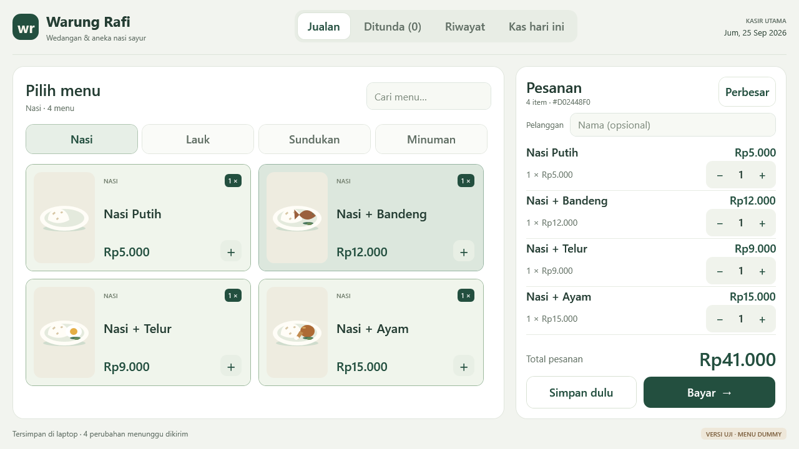
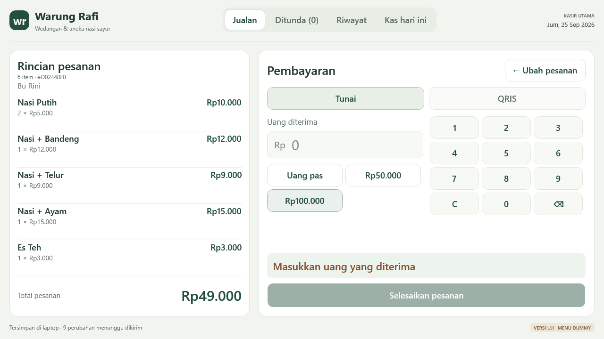

# M2 — perapian UI/UX kasir

## Tampilan aktual

Render WPF pada area kerja 1280×720 DIP, memakai data uji.





## Masalah dari screenshot pengguna

Daftar pesanan hanya memperoleh sisa tinggi setelah header besar, kolom nama dan dua tombol vertikal. Akibatnya beberapa item saja sudah terpotong. Warna teks global juga menimpa warna teks tombol primer, sehingga tulisan gelap berada di atas hijau gelap. Re-render seluruh halaman setiap klik menghilangkan posisi interaksi dan input nama yang belum disimpan.

## Revisi komposisi setelah review pengguna

Pengguna menilai preview pertama masih terlalu dasar dan belum cukup rapi. Revisi berikutnya mengubah komposisi, bukan hanya warna:

- Brand, navigasi dan tanggal berada dalam satu bar atas. Tanggal disembunyikan pada area sempit agar tombol navigasi tetap utuh; label versi uji tetap terlihat di footer.
- Katalog memiliki panel sendiri, heading dan kolom cari yang sejajar, serta kategori dengan penekanan lebih ringan daripada tombol pembayaran.
- Kartu mendatar menempatkan ilustrasi di sebelah nama/harga. Empat pilihan membentuk 2×2 pada area 1280×720, sehingga tidak ada baris tiga kartu dengan satu kartu terpisah di bawah.
- Ilustrasi nasi putih, bandeng, telur dan ayam dibedakan melalui aset vektor lokal; foto katalog aktual masih didukung. Ilustrasi ini bukan foto hidangan kedai.
- Lebar panel pesanan dijaga antara 380–440 DIP pada layout biasa; isi katalog memakai ruang selebihnya. Mode Perbesar tetap menggunakan seluruh lebar.
- Nama item dan subtotal sejajar di baris atas; jumlah × harga satuan dan kontrol jumlah berada di baris berikutnya. Nama pelanggan memiliki petunjuk opsional yang terlihat.
- Metode pembayaran memakai tab dengan penekanan ringan; input tunai memiliki awalan Rp dan angka yang lebih besar. Tombol penyelesaian tetap menjadi aksi utama yang paling menonjol.

## Perubahan

- Header dan navbar atas lebih ringkas. Panel utama memakai ruang tersisa dengan alignment stretch.
- Daftar pesanan memperoleh baris fleksibel; total dan dua tombol berdampingan tetap terlihat di bawah. Empat item biasa ditargetkan terlihat utuh pada area kerja 1280×720 DIP.
- Tombol **Perbesar** memberi panel pesanan seluruh lebar area kerja; **Kembali ke menu** mengembalikan katalog. Ini membantu membaca nama panjang. Pesanan yang melebihi tinggi layar tetap dapat digulir tanpa memindahkan total/tombol bayar.
- Baris pesanan menampilkan nama, subtotal, dan pengatur jumlah. Target tambah/kurang 44 DIP. Jumlah × harga satuan tampil langsung pada editor maupun rincian pembayaran.
- Menu berupa kartu putih dengan ilustrasi lokal sementara, harga, dan badge jumlah dipilih. Foto katalog tetap didukung. Kartu menyesuaikan jumlah kolom; pencarian mencakup empat kategori.
- Klik menu hanya memperbarui keranjang dan badge, bukan membangun ulang katalog. Item yang berubah dibawa ke area terlihat; posisi gulir dan fokus kontrol jumlah dipertahankan saat memungkinkan.
- Nama pelanggan disimpan setelah jeda ketik singkat dan sebelum aksi berikutnya. Menutup aplikasi menunggu penyimpanan nama yang belum selesai. Resume memakai versi order terbaru.
- Halaman pembayaran memiliki metode yang jelas, uang pas, nominal cepat yang mencukupi total, keypad, dan tombol selesai yang tetap terlihat. Pembayaran tunai tidak dapat diselesaikan ketika nominal kurang atau invalid.
- Layar sukses menonjolkan kembalian. Pesanan ditunda dan riwayat memiliki pencarian, status, waktu WIB, total, serta aksi yang sejajar. Riwayat memiliki halaman rincian seluruh item.
- Ringkasan kas menampilkan total, tunai, dan QRIS dalam tiga kartu, disertai batas arti angka agar tidak disalahartikan sebagai saldo rekening/laci.
- Warna hijau tua, putih hangat, dan aksen lembut; kontras primer putih/hijau, fokus keyboard terlihat. Animasi tekan 70–100 ms dan fade halaman/item 130 ms, tanpa menunda penyimpanan. Animasi mengikuti pengaturan animasi Windows saat aplikasi dibuka.
- Popup QRIS tetap pasif di pojok atas, tidak mengambil fokus atau menerima klik, tidak mengubah pesanan. Integrasi merchant nyata tetap M6.

## Verifikasi

Suite `tests/WarungRafi.UiChecks` menjalankan WPF asli di Windows dan membuat screenshot render aktual, bukan mockup HTML. Database sementara, jaringan dan printer dinonaktifkan melalui constructor internal khusus pengujian. Suite menguji ukuran ruang kerja 900×620, 1280×720, 1366×768, 1536×864, dan 1920×1080 dalam **device-independent pixels (DIP)**.

Ini memeriksa ukuran viewport, kontrol penting yang tetap berada di layar, keranjang kosong/panjang, kontras primer, perubahan jumlah, pencarian, nama tersimpan, ditunda/resume, nominal invalid/kembalian, QRIS pasif, penyelesaian, riwayat, dan pemulihan draf. Render ukuran DIP bukan pengujian monitor fisik pada setiap persentase DPI. Navigasi keyboard dasar diperiksa secara terprogram; kenyamanan pemakaian mouse/touchpad tetap ditinjau pada laptop pengguna.

```powershell
dotnet run --project tests/WarungRafi.UiChecks -c Release
```

Screenshot tersimpan pada artifact **WarungRafi-UI-review**. Paket aplikasi berada pada **WarungRafi-Windows-preview** dari run CI yang sama setelah semua pemeriksaan desktop lulus. Bukti run final dicatat di `STATUS.md`.

## Bukti checkpoint

[CI commit `de455eb`](https://github.com/Parjimin/warung-rafi/actions/runs/36063728912) lulus **69 pemeriksaan WPF**, ditambah 23 pemeriksaan dasar dan 60 recovery/integritas. Build/publish Windows, admin dan database lulus. Delapan belas screenshot aktual tersedia pada artifact **WarungRafi-UI-review**; tampilan jualan, pesanan diperbesar, pembayaran, ringkasan kas dan toast telah ditinjau secara visual pada revisi ini.

Viewport pesanan terukur 318 DIP pada area kerja 1280×720: empat item biasa muat tanpa scroll, begitu juga empat kartu menu dalam susunan 2×2. Pada area 900×620 viewport masih 218 DIP, dengan total dan tombol tetap terlihat; daftar panjang tetap digulir. Pada area pendek ini, bagian input/keypad pembayaran juga dapat digulir, sementara tombol penyelesaian tetap terlihat. Host render memakai ukuran eksplisit agar ukuran desktop runner tidak menimpa atau memotong review. Ini bukan uji sentuh fisik atau benchmark kecepatan klik.

## Batas dan sisa M2

- Validasi kenyamanan klik dan keterbacaan pada laptop pengguna masih diperlukan sebelum M2 ditutup. Touchscreen, printer dan merchant tetap M6.
- Ilustrasi adalah placeholder lokal; belum foto menu milik kedai.
- Pada layar pendek atau pesanan panjang, scroll tetap diperlukan. Tujuannya menghindari daftar terjepit, bukan mengecilkan teks agar seluruh pesanan muat sekaligus.
- Riwayat tetap menampilkan hingga 1.000 pesanan terbaru; pencarian berlaku pada daftar yang dimuat. Ringkasan harian tetap menghitung seluruh penjualan pada tanggal tersebut. Pagination seluruh arsip masih pekerjaan lanjutan.
- Belum ada benchmark latensi formal; animasi tidak menambahkan penundaan pada aksi transaksi.
