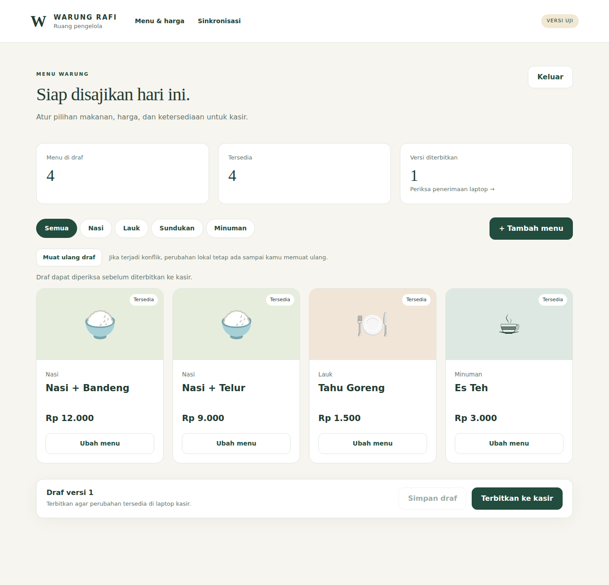
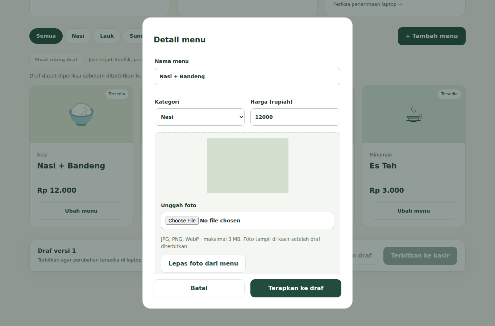
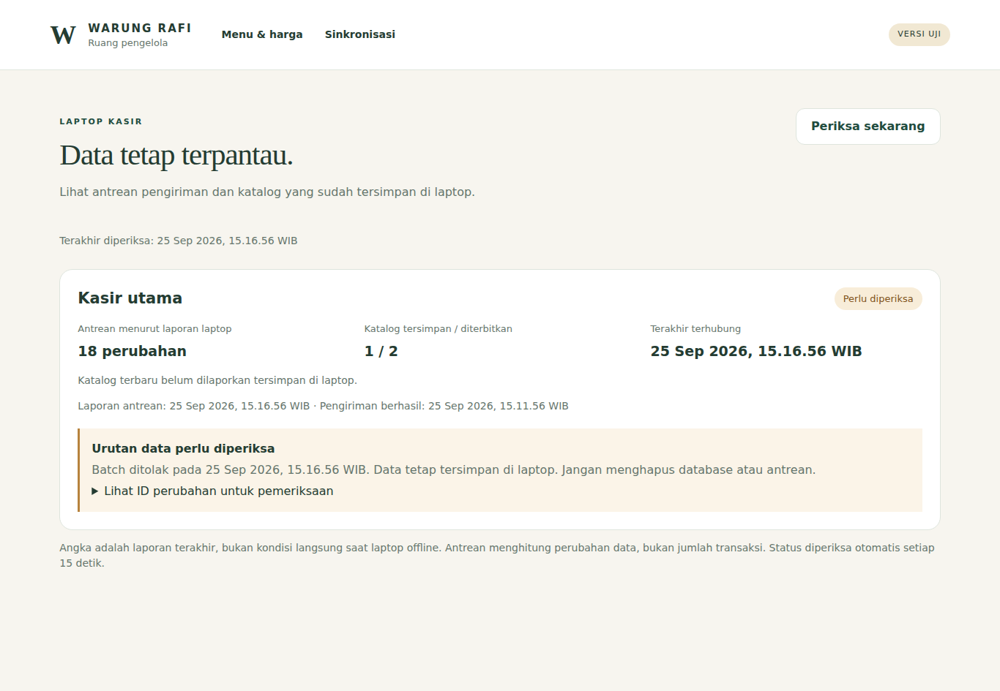

# M3 — Admin katalog dan sinkronisasi

## Hasil yang tersedia

Pengelola dapat menambah menu, mengubah harga/kategori/ketersediaan, mengunggah foto, menyimpan draf dan menerbitkannya. Empat kategori tetap Nasi, Lauk, Sundukan dan Minuman. Menu dinonaktifkan melalui ketersediaan; pesanan historis tidak dihapus atau berubah harga.

- **Draf**: perubahan lokal browser belum terkirim sampai Simpan draf ditekan. Draf server memiliki nomor versi. Tab lama ditolak ketika menyimpan atau menerbitkan versi yang sudah berubah. Perubahan browser tetap ditampilkan setelah konflik. Muat ulang draf meminta konfirmasi sebelum membuang perubahan lokal.
- **Terbitkan**: menyalin draf server menjadi katalog terbitan. Versi terbitan berbeda dari nomor versi draf. Label admin berbunyi “Versi diterbitkan”, bukan janji bahwa laptop sudah memakainya.
- **Penerimaan laptop**: katalog disimpan di SQLite. UI mengganti menu ketika halaman Jualan tidak berisi pesanan. Harga pada pesanan yang sudah dibuat tetap memakai snapshot lama. Halaman Sinkronisasi menampilkan versi katalog yang dilaporkan tersimpan di laptop.

## Foto menu

Di Detail menu, pilih JPG, PNG, atau WebP maksimal **3.000.000 byte**, foto diam maksimal 25 megapiksel. Server memeriksa akun pengelola dan origin sebelum membaca file. Batas ukuran diperiksa dari aliran byte, bukan hanya Content-Length atau ekstensi.

Server mendekode gambar, menolak input rusak/format palsu/animasi, menyesuaikan orientasi, mengecilkan maksimal 1200×1200 tanpa memperbesar gambar kecil, membuang metadata dan mengubahnya menjadi JPEG. JPEG dipilih agar didukung decoder Windows. Upload menggunakan path UUID baru, tanpa menimpa file foto sebelumnya. URL baru hanya diterapkan ke menu yang sedang diedit setelah storage mengonfirmasi keberhasilan.

Bucket `menu-photos` adalah **publik untuk membaca foto menu**; penulisan dilakukan server memakai service role setelah autentikasi admin. Jangan mengunggah dokumen pribadi. Service role tidak diteruskan ke browser atau laptop. URL HTTPS eksternal tetap didukung sebagai pilihan tambahan.

Foto baru belum mengubah katalog sampai Terapkan ke draf → Simpan draf → Terbitkan ke kasir. Membatalkan editor atau melepas foto dari menu tidak menghapus objek storage. Pembersihan foto tanpa referensi belum otomatis; jangan menghapus objek yang masih dirujuk draf/katalog. Ganti foto lewat unggah baru agar URL cache ikut berubah.

Laptop mencoba mengambil foto katalog di latar belakang, satu per satu. Unduhan dibatasi 5 MB dan didekode sebelum ditulis melalui file sementara + rename. Foto yang sudah berhasil disimpan dapat dipakai saat offline. Jika belum sempat diunduh, placeholder tetap terlihat; tidak ada janji seluruh foto langsung tersedia ketika koneksi terputus.

## Pemantauan sinkronisasi

Menu **Sinkronisasi** menampilkan per perangkat:

| Kolom | Arti |
| --- | --- |
| Antrean | Jumlah perubahan lokal yang belum diakui server, berdasarkan laporan terakhir; bukan jumlah transaksi |
| Katalog tersimpan / diterbitkan | Versi di cache laptop dibanding versi terbitan server; bukan versi harga pesanan aktif |
| Terakhir terhubung | Waktu server menerima batch atau laporan perangkat |
| Laporan antrean | Waktu server menerima jumlah antrean dan versi katalog dari laptop |
| Pengiriman berhasil | Waktu terakhir batch berhasil diproses, termasuk retry idempoten |
| Konflik | Waktu batch ditolak dan daftar ID event untuk pemeriksaan; tidak menampilkan payload pelanggan |

Halaman memuat ulang setiap 15 detik. Label “Baru terhubung” memakai batas 90 detik, bukan jaminan koneksi saat ini. Data yang tampil tetap merupakan laporan terakhir. Saat laptop offline, angka bisa tertinggal. Laporan perangkat tidak menghapus status konflik; status itu diperbarui oleh percobaan batch berikutnya. Pengelola tidak diberi tombol menghapus outbox atau memaksa penimpaan data.

Batch tetap maksimal 50 event. Fungsi database membungkus ingest dalam subtransaksi: satu konflik membatalkan seluruh batch, lalu menyimpan diagnostik di luar subtransaksi. API mengembalikan 409 tanpa acknowledgement. Gangguan database mengembalikan kegagalan, bukan sukses palsu. Laptop hanya menandai ID yang dikenal dan diakui server sebagai terkirim. Retry tidak menggandakan catatan.

Pengiriman pesanan, pembacaan katalog, laporan status dan pembacaan pembayaran memiliki penanganan kegagalan terpisah. Konflik outbox tidak menghentikan pengambilan katalog atau notifikasi pembayaran. Transaksi lokal tidak menunggu jaringan.

## Setup layanan uji

1. Jalankan `database/001_foundation.sql` pada proyek Supabase baru; untuk proyek yang sudah memiliki fondasi, jangan ulangi file ini.
2. Jalankan migration baru `database/002_sync_monitor.sql` satu kali.
3. Jalankan `database/storage/menu_photos.sql` melalui SQL Editor Supabase untuk membuat/mengatur bucket foto. Script ini memerlukan schema Storage Supabase, bukan PostgreSQL polos.
4. Buat satu user Supabase Auth untuk pengelola. Isi environment server seperti `.env.example`: URL, anon key, service role, UUID admin, origin aplikasi, ID/token perangkat. Tidak ada kredensial nyata di fixture.
5. Deploy Next.js di Vercel dengan Root Directory `apps/admin`. Gunakan origin domain yang benar. Penyimpanan persisten berada di Supabase/SQLite, bukan filesystem function Vercel.
6. Konfigurasikan URL HTTPS dan token perangkat yang sama di laptop. Jalankan preview terbaru.
7. Uji tambah menu + foto → simpan → terbitkan → pastikan versi cache laptop meningkat di Sinkronisasi. Uji putus koneksi setelah foto ter-cache dan kirim ulang antrean setelah tersambung.

Deployment dan pengujian proyek Supabase/Storage/Vercel nyata belum dilakukan tanpa akses/proyek yang dikonfigurasi. Printer, touchscreen dan merchant tetap M6. Kode publik tidak memuat kunci atau token produksi.

## Pengujian yang dapat diulang

```bash
cd apps/admin
npm ci
npm test
npm run typecheck
npm run build
node --test integration/api.test.ts
npx playwright install chromium --only-shell
node integration/browser.mjs
```

`integration/harness.ts` menjalankan Next hasil build dengan service Supabase tiruan di localhost. Ia hanya diimpor runner pengujian, tidak menjadi route produksi dan tidak mematikan autentikasi aplikasi. Pengujian API memeriksa admin/origin, unggah dan kegagalannya, konflik versi, publikasi, heartbeat, izin pembacaan monitor, dan kegagalan sinkronisasi. Fixture HTTP tidak membuktikan perilaku akun Supabase nyata.

```powershell
dotnet run --project tests/WarungRafi.SyncChecks -c Release
```

Suite Windows menguji HTTP gagal/offline/409, local write tetap berjalan, katalog independen, harga snapshot, acknowledgement rusak/sebagian, heartbeat, retry, katalog setelah restart, serta decoder/cache foto WPF nyata dengan HTTP tiruan. Suite memakai database dan cache sementara, bukan data kasir.

CI PostgreSQL menjalankan migration 001+002 serta assertions dedupe/rollback/konflik/persistensi diagnostik/hak akses. Bucket Storage hanya diverifikasi nanti di proyek Supabase aktual; ia tidak dipalsukan sebagai schema Storage produksi di pengujian SQL.

## Bukti checkpoint

[CI 4e3fb3c](https://github.com/Parjimin/warung-rafi/actions/runs/36111996368) lulus untuk admin, database dan desktop. Hasil: 13 tes unit admin, 5 skenario API (6 hitungan Node termasuk pembungkus), alur browser, 15 sync/cache Windows, 69 UI WPF serta 83 pemeriksaan domain/recovery. Screenshot memakai fixture berlabel versi uji; angka monitor adalah simulasi, bukan transaksi kedai.







Review visual juga memperbaiki bar publikasi agar tidak menutupi nama menu dan menjaga tombol Batal/Terapkan tetap terlihat di editor foto. Screenshot desktop dan mobile lengkap tersedia pada artifact **WarungRafi-M3-admin-review**.

## Batas checkpoint

- M3 belum ditutup sampai konfigurasi dan alur cloud–laptop pada proyek uji nyata terverifikasi.
- Draf browser tidak otomatis tersimpan setelah tab ditutup; peringatan keluar diberikan. Konflik ditangani dengan pemeriksaan dan muat ulang, belum merge otomatis antar editor.
- Monitoring mengandalkan laporan perangkat; tidak dapat mengetahui perubahan lokal baru selama offline.
- Belum ada pembersihan objek foto yatim atau pengelolaan banyak laptop/cabang. Target saat ini satu laptop.

## Referensi implementasi

- [Supabase standard uploads](https://supabase.com/docs/guides/storage/uploads/standard-uploads): upload kecil dan path baru untuk menghindari cache foto lama.
- [Vercel Function limits](https://vercel.com/docs/functions/limitations): batas body function; upload aplikasi dibatasi 3 MB.
- [Sharp constructor](https://sharp.pixelplumbing.com/api-constructor/): decoding, failOn dan limitInputPixels.
