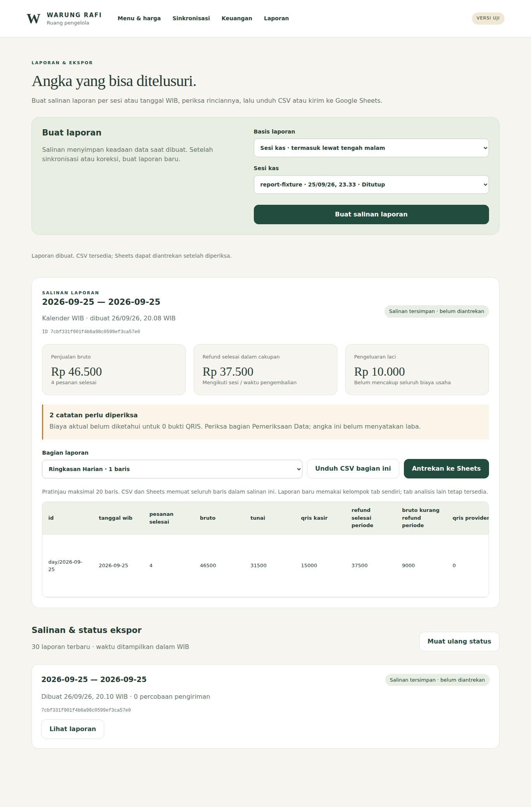
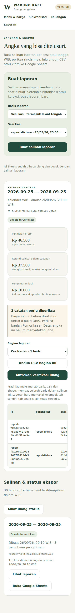

# M5 tahap 3 — laporan, CSV, dan Google Sheets

Halaman **Laporan** (`/laporan`) membuat salinan tetap dari database pusat. Penjualan kasir tidak menunggu ekspor. Perubahan sumber sesudah salinan dibuat tidak mengubah angka di dalamnya; buat laporan baru untuk memasukkan sinkronisasi, refund atau koreksi yang baru diterima.

## Alur pengelola

1. Pilih sesi kas (default, termasuk sesi lewat tengah malam) atau tanggal kalender WIB, maksimal 31 hari. Daftar pilihan berisi 50 sesi terakhir.
2. Tekan **Buat salinan laporan**. Tinjau bruto, refund periode, pengeluaran laci dan bagian **Pemeriksaan Data**. Pratinjau menampilkan maksimal 20 baris; CSV serta Sheets memuat seluruh baris.
3. Pilih bagian dan **Unduh CSV bagian ini**. Setiap CSV memakai UTF-8 BOM, koma, kutip untuk teks, dan metadata ID laporan, basis, periode, waktu snapshot WIB serta mata uang IDR pada setiap baris. Untuk bagian kosong, header tetap tersedia; metadata lengkap juga ada pada Info Laporan.
4. Sesudah diperiksa, tekan **Antrekan ke Sheets**. **Proses sekarang** menjalankan satu pekerjaan; runner terjadwal dapat mengambil antrean secara terpisah.
5. Status **Sheets terverifikasi** hanya dicatat setelah seluruh sel sumber dibaca ulang dan cocok, termasuk tipe angka/teks. Status menyebut waktu verifikasi terakhir; perubahan pemilik setelah waktu itu baru ditemukan saat verifikasi ulang.
6. Bila pembuatan laporan kehilangan respons, halaman menawarkan **Periksa pembuatan laporan** memakai ID sama, termasuk setelah reload pada tab yang sama. CSV tetap tersedia walau koneksi/izin Sheets bermasalah. Menutup tab dapat menghilangkan draf browser; periksa daftar salinan sebelum membuat laporan pengganti.

## Cakupan dan kolom

Semua bagian memiliki ID stabil; nomor baris spreadsheet bukan identitas transaksi. ID gabungan memuat perangkat agar pesanan dari perangkat berbeda tidak bertabrakan.

| Bagian | Kolom dan arti utama |
| --- | --- |
| Ringkasan_Harian | Tanggal WIB, jumlah selesai/batal, bruto, tunai, QRIS kasir, refund berhasil pada periode, bruto kurang refund periode, QRIS provider, aktual/estimasi, jumlah biaya belum diketahui, neto payout, mutasi bank, pengeluaran/masukan laci |
| Transaksi | Perangkat, ID/nomor pesanan, kasir tercatat, sesi selesai, waktu dibuat/selesai/batal, status/metode, bruto, uang diterima, kembalian, pasangan provider, refund kumulatif sampai snapshot, versi dan alasan batal |
| Detail_Penjualan | ID baris stabil, transaksi, produk, nama/kategori/harga snapshot, jumlah, subtotal, waktu bayar, batas data |
| Rekap_Produk | Produk/nama/kategori snapshot, unit dan nilai bruto; refund per item kosong karena sumber hanya menyimpan refund nominal |
| Pembayaran_QRIS | Identitas provider/order/merchant, waktu bayar/terima server, status, nominal, cakupan periode, pasangan dan selisih, estimasi/tarif snapshot, MDR/biaya lain/refund aktual, referensi dan sumber |
| Pencairan_Dana | Referensi/tanggal laporan, bruto, biaya transaksi/refund/biaya pencairan/penyesuaian/neto, bank dan rekening tersamar, waktu/nominal/referensi mutasi, selisih, status aktif/batal serta penanda periode laporan/mutasi |
| Detail_Pencairan | Pencairan, bukti provider, bruto, biaya, refund dan neto sebelum biaya batch; hanya alokasi aktif. Rincian pencairan yang dibatalkan ditelusuri melalui audit keuangan |
| Pengembalian | Refund dan transaksi asal, sesi pengembalian, nominal/metode/status, waktu permintaan/selesai, penanda selesai dalam periode, pemohon/penyetuju, alasan/referensi/kegagalan |
| Kas_Harian | Sesi utuh, buka/tutup/petugas, modal, penjualan tunai neto kembalian, kas masuk lain, refund tunai, kas keluar, seharusnya/fisik/selisih, status/catatan |
| Pergerakan_Kas | ID gerakan, sesi, waktu, jenis, masuk/keluar, transaksi, alasan/petugas, penanda cakupan periode |
| Pengeluaran | Kas keluar dalam periode, waktu/nominal, sumber laci, sesi, alasan/petugas; kategori dan lampiran belum direkam |
| Pemeriksaan_Data | Ketidaklengkapan perangkat, sesi belum diketahui, pesanan/bukti belum cocok, selisih pasangan/bank, biaya belum diketahui |
| Aktivitas | Waktu, pelaku, tindakan, objek dan alasan perubahan keuangan/katalog serta jurnal kas. Rincian audit lengkap tetap pada sumber |
| Info_Laporan | ID dan format, basis/periode, waktu snapshot, revisi keuangan, IDR, kelengkapan dan batas data |

## Basis perhitungan

- Omzet memakai pesanan selesai, bukan draf/batal. Jumlah subtotal item harus sama dengan pembayaran; jurnal kas harus sama dengan saldo sesi. Ketidakcocokan menolak penyajian, bukan membetulkan sumber secara diam-diam.
- Refund pada ringkasan mengikuti waktu berhasil (kalender) atau sesi pengembalian (mode sesi). Refund yang belum berhasil tidak mengurangi total. Refund kumulatif transaksi asal adalah kolom konteks tersendiri; dapat mencakup waktu di luar filter.
- Provider, biaya, dan pencairan tidak ditambahkan lagi ke omzet. Biaya belum diketahui tetap kosong dan dihitung sebagai pengecualian; angka 0 hanya untuk nilai yang diketahui nol. Tidak ada label laba bersih.
- Mode sesi mencakup pesanan yang ditautkan jurnal penjualan ke sesi itu. Pesanan batal memakai jendela waktu/perangkat sesi; sumber belum menyimpan identitas sesi pembatalan. Bukti provider hanya pasangan pesanan sesi; belum merupakan seluruh penerimaan provider saat sesi berlangsung. Pencairan dan mutasi bank tersedia pada mode kalender, karena sumber hanya merekam tanggal, bukan identitas sesi.
- Mode kalender juga menyertakan konteks pasangan provider yang dibayar di luar periode, dengan penanda; angka provider ringkasan tetap mengikuti tanggal pembayaran. Payout dilaporkan dan mutasi bank memakai tanggal masing-masing, sehingga pencairan di luar periode yang diterima bank dalam periode tetap tampil.
- Kas_Harian berisi sesi utuh yang bersinggungan dengan periode, termasuk gerakan di luar tanggal filter. Pergerakan_Kas menandai tiap gerakan di dalam/luar periode. Pengeluaran hanya memakai gerakan kas keluar dalam cakupan.
- Sumber belum menyimpan identitas kasir pribadi, sesi pembuatan, tipe paket/unit/versi katalog, kategori/lampiran pengeluaran atau refund per item. Angka/data itu tidak direkayasa. Label pelanggan dihapus dari sumber snapshot laporan. Batas praktis: 5.000 pesanan, 20.000 event, 6 MB sumber atau 150.000 sel; pilih periode lebih pendek jika terlampaui. Tidak ada pemotongan baris diam-diam.

## Identitas, antrean dan pemulihan

Setiap salinan memiliki ID 32 karakter dan JSON sumber yang tetap. Pengiriman ulang pembuatan dengan ID/filter/pelaku sama mengembalikan salinan lama; perubahan identitas ditolak. Snapshot tersimpan atomik dalam database, terpisah dari transaksi penjualan.

Satu workbook tujuan dapat menampung beberapa salinan. Setiap salinan memakai 14 tab `WR_<id-laporan>_<bagian>`. Ini pilihan implementasi dari rancangan tab awal: versi baru masuk kelompok baru, sehingga proses lama yang terlambat tidak dapat menimpa angka versi baru. Retry menulis ulang rentang deterministik pada tab yang sama, bukan append. Tab analisis milik pemilik tidak diubah. Buat laporan baru saat sumber berubah; ini arsip laporan, bukan cermin langsung yang terus diperbarui.

Antrean memiliki lease dua menit dan token pekerja. Satu pekerjaan per workbook berjalan pada satu waktu; lease kadaluarsa dapat diambil alih, tetapi pekerja lama tidak dapat memberi acknowledgement database. Jika penulisan Google selesai setelah koneksi putus, retry memeriksa identitas tab lalu menulis nilai yang sama. Ukuran/identitas tab yang berubah ditolak. Setiap batch dibatasi sekitar 1,5 MB; proses mempunyai batas waktu dan dapat diulang. Seluruh sel dibaca ulang sebelum hash SHA-256 dan waktu verifikasi disimpan.

Kegagalan jaringan, quota, layanan atau verifikasi mendapat backoff eksponensial dengan jitter, sampai enam kegagalan tercatat. Izin/konfigurasi/target perlu pemeriksaan pengelola; **Jadwalkan ulang** mempertahankan salinan dan riwayat percobaan. Perubahan spreadsheet tujuan tidak memindahkan laporan lama diam-diam; buat salinan baru untuk tujuan baru. Riwayat pekerjaan menampilkan 30 salinan terakhir; snapshot dan riwayat percobaan lengkap tetap di database. Pengarsipan/pembersihan workbook belum otomatis; kapasitas tujuan tetap harus dipantau.

Teks dikirim sebagai `stringValue`, bukan formula. CSV menambahkan apostrof pada teks yang dapat dianggap rumus atau kehilangan nol awal/ketelitian ID. Nominal numerik tetap angka. Tab sumber dibuat dengan protected range untuk akun layanan; pemilik spreadsheet tetap mempunyai wewenang Google atas file tersebut. Hindari mengubah tab sumber; gunakan tab analisis terpisah.

## Setup setelah layanan cloud tersedia

Belum ada koneksi Google milik pengguna atau kredensial produksi yang dipasang dalam checkpoint ini. Langkah berikut dikerjakan pada environment uji dahulu, setelah Supabase/admin M3 tersedia.

1. Jalankan migrasi 001–005 berurutan. Jangan mengulang migrasi awal pada database terisi.
2. Aktifkan Google Sheets API pada proyek Google Cloud khusus aplikasi. Buat service account tanpa delegasi domain, lalu simpan kredensial RSA JSON hanya sebagai secret server. Tidak perlu memberi role luas terhadap proyek untuk akses isi spreadsheet.
3. Buat workbook kosong khusus laporan dan bagikan sebagai **Editor** kepada `client_email` akun layanan. Pemilik dapat membaca workbook dari akun Google yang memiliki akses. Jangan memakai workbook umum yang berisi tab penting sebagai percobaan pertama.
4. Isi `GOOGLE_SHEETS_ID` dan `GOOGLE_SERVICE_ACCOUNT_JSON` di environment server, bukan `NEXT_PUBLIC_*`. JSON memuat private key; jangan masukkan ke Git, browser atau screenshot. `token_uri` dari file tidak dipakai sebagai alamat bebas; OAuth selalu menuju endpoint Google yang ditetapkan di kode.
5. Atur secret acak terpisah `EXPORT_RUNNER_TOKEN` minimal 32 karakter. Endpoint `POST /api/jobs/sheets` memerlukan bearer ini; token laptop tidak dapat menjalankannya.
6. Konfigurasikan scheduler hosting/runner yang memanggil `node scripts/run-sheets-export.mjs` dengan HTTPS `APP_ORIGIN` dan secret tersebut, misalnya setiap beberapa menit. Satu panggilan memproses satu pekerjaan siap. Penjadwalan aktual belum diaktifkan oleh checkpoint ini. Tanpa scheduler, tombol **Proses sekarang** tetap tersedia.
7. Uji snapshot kecil, CSV, izin ditolak, respons terputus, retry dan pembacaan ulang pada workbook uji. Pastikan baris/total cocok dengan database sebelum penggunaan usaha. Rotasi private key dan pengaturan akses operasional termasuk hardening/finalisasi.

## Dasar integrasi resmi

- [Sheets batchUpdate](https://developers.google.com/workspace/sheets/api/reference/rest/v4/spreadsheets/batchUpdate): validasi dan penerapan atomik dalam satu batch. Beberapa batch tidak dianggap satu transaksi keseluruhan; status verifikasi aplikasi tetap diperlukan.
- [UpdateCells](https://developers.google.com/workspace/sheets/api/reference/rest/v4/spreadsheets/request#UpdateCellsRequest): rentang tetap dan field mask nilai sel.
- [OAuth service account](https://developers.google.com/identity/protocols/oauth2/service-account): assertion RS256 untuk token akses dengan scope Sheets saja.
- [Usage limits](https://developers.google.com/workspace/sheets/api/limits): pengelompokan permintaan, quota dan backoff. Tidak ada batas penggunaan komersial/biaya yang diasumsikan dari angka fixture.

## Verifikasi checkpoint

Lokal: 32 tes unit admin, 14 skenario API (16 hasil Node termasuk pembungkus), typecheck/build Next dan enam suite SQL pada PostgreSQL WASM. Kontrak laporan berasal dari serializer C# yang melewati migrasi/RPC PostgreSQL, bukan data saldo buatan terpisah. Sampel manual: bruto Rp46.500, tunai Rp31.500, QRIS kasir Rp15.000, refund berhasil Rp37.500, kas keluar Rp10.000; sesi ditutup seharusnya Rp112.500, fisik Rp112.000, selisih −Rp500. Integrasi Google memakai transport fixture dan kunci uji sementara; akun Google nyata serta scheduler belum diuji. [CI `5c2b7f7`](https://github.com/Parjimin/warung-rafi/actions/runs/36244233885) lulus tanpa retry: 306 pemeriksaan Windows, 32 unit admin, 14 skenario API, tiga alur browser, typecheck/build/publish, migrasi 001–005 dan enam suite PostgreSQL 17. Browser membuktikan respons hilang → reload → retry, CSV, quota dan penulisan Sheets terputus → retry dengan tetap 14 tab, serta layout ponsel tanpa overflow halaman. M5/#11 tetap terbuka untuk pemasangan dan pengujian koneksi Google nyata/scheduler.

## Screenshot aplikasi hasil CI

Gambar di bawah memakai fixture uji; label Sheets terverifikasi mengacu pada baca ulang transport uji, bukan workbook Google pengguna. Lima gambar lengkap tersedia pada artifact **WarungRafi-M5-reports-review** di run CI tersebut.

