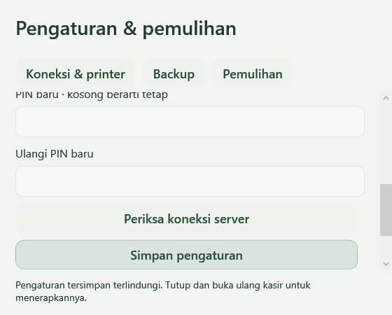
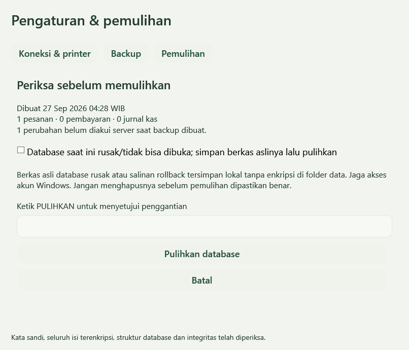

# M6 — Pemasangan, pengaturan dan pemulihan

Tahap ini menyelesaikan perangkat lunak persiapan rilis. Akun Google, Supabase/Vercel, Midtrans, printer dan touchscreen nyata belum diuji. Gunakan paket untuk persiapan dan UAT; pemakaian produksi menunggu pemeriksaan perangkat serta akun pemilik.

## Pasang atau perbarui di Windows

1. Unduh artifact **WarungRafi-Windows-install** dari run **Verify application** yang seluruh job-nya lulus. Ekstrak ZIP lengkap ke folder lokal; jangan menjalankan dari dalam ZIP.
2. Tutup Warung Rafi. Jalankan **Pasang-WarungRafi.cmd** menggunakan akun Windows kasir, tanpa Run as administrator. Paket belum ditandatangani; identitas penerbit Windows belum tersedia. Gunakan hanya artifact repo ini pada commit yang sudah ditinjau.
3. Installer memverifikasi ukuran dan SHA-256 semua berkas payload, menyalin ke folder versi baru, memeriksa salinan, lalu mengganti penunjuk versi aktif. Hash mendeteksi paket rusak; bukan bukti tanda tangan penerbit. Kegagalan sebelum aktivasi mempertahankan versi aktif; pemasangan dapat diulang.
4. Buka **Warung Rafi** dari desktop/menu Start. **Pemulihan Warung Rafi** membuka pengaturan dengan kasir berhenti. Pada paket portable, gunakan **Pengaturan.cmd**.
5. Aplikasi dipasang per pengguna di `%LOCALAPPDATA%\Programs\WarungRafi`; transaksi tetap di `%LOCALAPPDATA%\WarungRafi\warung-rafi.db`. Versi program lama dipertahankan. Jangan menghapus folder data saat memperbarui, dan jangan menjalankan program lama setelah migrasi database tanpa pemeriksaan kompatibilitas.

Untuk menghapus program, tutup kasir lalu jalankan `Uninstall-WarungRafi.ps1` dalam folder pemasangan menggunakan PowerShell akun yang sama. Penghapusan hanya menghapus program yang dikenali, bukan transaksi/pengaturan/backup. Pemasangan ulang memakai data yang sama. Folder tujuan tidak boleh mencakup folder transaksi. Satu kunci proses mencegah kasir dan pemulihan membuka database yang sama bersamaan.

## Pengaturan laptop

Buka tombol **Pengaturan**, buat PIN pengelola 6–12 angka, kemudian isi koneksi/printer. Tidak ada PIN bawaan. Keluar dan buka ulang kasir setelah menyimpan perubahan. PIN refund dan pengaturan memakai hash PBKDF2; lima PIN salah menahan percobaan selama lima menit. Kegagalan pengaturan bertahan setelah aplikasi dibuka ulang.

| Isian laptop | Nilai yang disiapkan |
| --- | --- |
| Alamat HTTPS admin | Origin saja, misalnya `https://admin.example.com`, tanpa path/query |
| Token laptop | Nilai acak 32–512 karakter, sama dengan `DEVICE_API_TOKEN` server |
| Printer Windows | Nama printer terpasang; dipilih/ditulis setelah driver tersedia |
| PIN pengelola | Rahasia pengelola; penggantian memerlukan PIN yang berlaku |
| Folder backup | Lokasi lengkap; salin juga ke media lain |
| Kata sandi backup | 12–256 karakter; berbeda dari PIN, simpan di tempat terpisah |

Alamat kosong memungkinkan penggunaan offline. Tombol **Periksa koneksi server** memeriksa autentikasi perangkat dan migrasi 006; hasilnya bukan bukti bahwa Google/Midtrans/printer telah berfungsi. Origin yang telah diikat ke database tidak boleh diganti sembarangan. Identitas `DEVICE_ID` server juga dipertahankan ketika pemeriksaan recovery dilakukan.

`settings.protected` dienkripsi dengan Windows DPAPI untuk akun Windows yang menyimpannya. Token, hash PIN dan kata sandi backup tidak ditulis dalam JSON plaintext dan tidak masuk backup transaksi. Berkas pengaturan tidak dapat dipindahkan ke akun/laptop lain begitu saja. Pada laptop baru buat PIN, isi token dan kata sandi backup kembali. Jika berkas pengaturan rusak, pembukaan gagal tanpa mengganti berkas atau menghapus transaksi; simpan salinannya sebelum bantuan pemulihan. Perlindungan ini tidak menahan pengguna yang sudah menguasai akun Windows yang sama.

Untuk upgrade preview lama: bila pengaturan terlindungi belum ada, aplikasi mengimpor `WARUNG_API_BASE_URL`, `WARUNG_DEVICE_TOKEN`, `WARUNG_PRINTER_NAME` dan `WARUNG_MANAGER_PIN_HASH` dari environment. Setelah pengaturan berhasil dipakai, hapus nilai lama dari environment pengguna melalui Windows agar rahasia tidak tertinggal di sana. Setelah `settings.protected` ada, perubahan environment tidak menimpanya. `scripts/Set-ManagerPin.ps1` kini membuka pengaturan.

## Pasang server dan koneksi saat akun tersedia

1. Terapkan migrasi `001_foundation.sql` sampai **`006_operations.sql`** secara berurutan pada proyek Supabase yang sama. Terapkan 006 sebelum kode admin baru karena login memerlukan pembatas percobaan di database.
2. Deploy web dari `apps/admin`; isi variabel sesuai `.env.example`. `APP_ORIGIN` harus origin browser persis, tanpa garis miring akhir. Service role hanya di server. Buat satu akun pengelola dan pasang UUID pada `ADMIN_USER_ID`; pengguna lain ditolak.
3. Buat token perangkat acak minimal 32 karakter. Pasang token server dan laptop yang sama; jaga `DEVICE_ID` tetap. Periksa koneksi lalu uji katalog, penjualan tunai, antrean offline/reconnect, dan catatan admin memakai data UAT.
4. Ikuti [panduan QRIS](M4-QRIS.md) untuk aktivasi merchant static QRIS, key lingkungan yang benar dan webhook `/api/midtrans/notification`. Status settlement bukan bukti dana sudah masuk bank. Uji merchant nyata dilakukan bersama pemilik dengan nominal yang disetujui.
5. Ikuti [panduan Sheets](M5-REPORTS-SHEETS.md): workbook khusus, akun layanan, akses workbook, `GOOGLE_SHEETS_ID`, `GOOGLE_SERVICE_ACCOUNT_JSON`, token runner dan scheduler. Gunakan snapshot UAT; periksa hasil baca ulang serta jumlah baris/total setelah retry. Key Google dan Midtrans tidak dipasang pada laptop.

Login admin dibatasi di database: maksimal 10 upaya per identitas email dan 120 keseluruhan dalam jendela 10 menit. Identitas email disimpan sebagai HMAC, bukan email mentah; limiter dibagi lintas instance aplikasi. Bila database limiter gagal, login ditolak sementara. Satu akun pengelola tetap merupakan model akses versi ini; MFA dan multi-role bukan fitur yang disediakan aplikasi ini.

Pergantian token tanpa langsung memutus laptop: pasang token baru sebagai `DEVICE_API_TOKEN`, token lama sebagai `DEVICE_API_TOKEN_PREVIOUS`, dan batas UTC absolut `DEVICE_TOKEN_PREVIOUS_UNTIL` maksimal tujuh hari ke depan. Perbarui laptop melalui Pengaturan, periksa koneksi, lalu hapus kedua variabel token lama. Token lama di luar masa berlaku ditolak. Jangan menyalin token ke issue, screenshot, log, atau repo.

## Backup

Aktifkan folder dan kata sandi di tab **Backup**. **Buat backup sekarang** membuat file `.wrbackup` baru; nama yang sudah ada ditolak agar backup lama tidak tertimpa. Backup otomatis mencoba saat kasir terbuka dan layar pembayaran tidak aktif, memeriksa setiap lima menit, dengan jarak minimal 24 jam setelah backup otomatis terakhir yang berhasil. Jadwal tidak berjalan saat program/laptop mati. Tidak ada penghapusan backup lama otomatis.

Snapshot menggunakan API backup SQLite agar transaksi committed dalam WAL ikut tersimpan. Pengambilan snapshot memakai kunci penyimpanan singkat; dapat menunda penulisan selama penyalinan. Enkripsi berjalan di luar kunci kasir. Arsip memuat pesanan, pembayaran, kas/refund, seluruh jurnal/outbox, katalog, bukti QRIS/cursor dan riwayat cetak. Foto cache dan kredensial tidak ikut.

Format v1 memakai AES-256-GCM per blok dengan header terautentikasi, salt acak dan kunci PBKDF2-SHA256 600.000 iterasi. Batas snapshot 2 GiB. Kata sandi salah, isi berubah, blok terpotong dan byte tambahan ditolak. Setelah dekripsi dilakukan pemeriksaan identitas/versi/schema, SQLite integrity/foreign keys, kontinuitas jurnal serta kecocokan pesanan/pembayaran. Ini pengujian implementasi, bukan sertifikasi atau audit kriptografi independen.

**Kata sandi backup tidak dapat dipulihkan dari file backup.** Simpan terpisah. Arsip di disk laptop yang sama tidak melindungi dari kehilangan laptop/disk; pindahkan salinan ke media lain dan lakukan uji restore. File database aktif, snapshot sementara dan salinan rollback lokal tidak dienkripsi oleh format backup; batasi akses akun Windows dan gunakan perlindungan disk sesuai kebijakan pemilik.

## Pulihkan

1. Tutup kasir dan program lain yang membuka SQLite. Buka **Pemulihan Warung Rafi** lalu masuk dengan PIN pengelola.
2. Pilih file dan masukkan kata sandinya. **Periksa isi backup** menampilkan tanggal WIB, jumlah pesanan/pembayaran/jurnal serta antrean pada saat snapshot. Database aktif belum diganti.
3. Periksa bahwa tanggal dan identitas backup sesuai. Ketik **PULIHKAN** untuk menyetujui penggantian. File diperiksa kembali; file yang berubah sesudah review ditolak.
4. Kondisi database sehat saat ini dibuatkan backup terenkripsi di `RecoverySafety` memakai kata sandi file yang sedang dipulihkan. Penggantian menyimpan salinan `.before-restore-*` lokal. Jika database rusak, centang mode rusak secara eksplisit; berkas database/WAL/SHM asli disalin ke `RecoverySafety/unreadable-*` sebelum penggantian. Salinan mentah ini **tidak terenkripsi**; jangan bagikan atau hapus sebelum pemulihan selesai diperiksa.
5. Kasir tetap ditahan setelah penggantian. Klik **Periksa kecocokan cloud**. Pemeriksaan membandingkan versi/isi pesanan dan frontier jurnal dengan seluruh halaman cloud serta memeriksa lagi bahwa sumber tidak berubah. Server yang lebih baru/berbeda membuat pemulihan ditahan; gunakan backup lebih baru atau inspeksi bersama pengelola. Aplikasi tidak menimpa cloud agar menerima backup lama.
6. Database yang belum pernah terhubung cloud boleh dilanjutkan dengan **Gunakan database yang belum pernah terhubung cloud**. Kewajiban pemeriksaan tetap ada untuk koneksi cloud pertama. Mengembalikan backup sebelum koneksi tidak menghapus ikatan cloud yang masih terbaca dari database saat ini.
7. Tutup pemulihan, buka kasir, periksa sesi kas, riwayat, nominal, antrean dan satu struk UAT. Event dikirim ulang dengan ID historis yang sama; server mengakui replay yang identik. Jangan mengubah ID/perangkat atau menghapus jurnal untuk melewati konflik.

Pada laptop pengganti: pasang program, buka Pemulihan, buat PIN lokal, isi alamat/token yang benar, lalu pulihkan arsip dengan kata sandinya. Jangan mengaktifkan dua laptop berjualan dengan salinan database/identitas perangkat yang sama. Kunci aplikasi lokal tidak mengunci komputer lain; desain aplikasi ini untuk satu kasir aktif.

## Pemeriksaan akhir sebelum dipakai

- [ ] Katalog, penjualan dan antrean laptop nyata cocok dengan admin; putus/sambung internet tidak menggandakan data.
- [ ] Satu ekspor Sheets nyata berhasil, total cocok, retry tidak menggandakan tab/baris; scheduler terbukti berjalan.
- [ ] QRIS merchant nyata terverifikasi, nominal sama tidak melunasi pesanan otomatis, popup/suara tepat, rekonsiliasi serta dana bank diperiksa terpisah.
- [ ] Printer: driver/nama tepat; struk nyata terbaca pada lebar kertas; uji kertas habis/kabel terputus/cetak ulang. Status `submitted` hanya berarti diterima spooler, bukan kertas telah keluar.
- [ ] Touchscreen/laptop: tombol terbaca, skala DPI, keyboard, sentuhan, pesanan panjang, layar pembayaran dan settings nyaman.
- [ ] Backup ke media lain dan restore pada salinan UAT lulus; kata sandi/PIN/token tersimpan oleh pengelola; update/uninstall tidak menghilangkan data.
- [ ] Pemilik menyetujui UAT, akun produksi dan nominal awal sebelum transaksi usaha.

## Bukti pengujian

[CI `52ff711` — seluruh job lulus](https://github.com/Parjimin/warung-rafi/actions/runs/36273095782): 383 pemeriksaan Windows, 32 unit admin, 18 skenario API (21 hasil dengan pembungkus), tiga alur browser, tujuh suite PostgreSQL 17 dan audit dependency. [Paket Windows teruji](https://github.com/Parjimin/warung-rafi/actions/runs/36273095782/artifacts/10915539501).

Layar kecil tetap menyediakan gulir dan status tetap terlihat:

Review backup sebelum database diganti:

Suite `BackupChecks` menguji arsip rusak, kata sandi, metadata, pemeriksaan sebelum restore, database rusak, salinan sebelum penggantian dan ikatan cloud. `OperationsChecks` menguji DPAPI/PIN, pengaturan, layar kecil serta alur restore Windows. `SyncChecks`, API integration dan `database/tests/operations.sql` menguji gate cloud, setup, limiter dan masa token. `Test-WindowsPackage.ps1` memeriksa pemasangan terputus, update, hash, path, uninstall dan pemasangan ulang dengan data di luar folder aplikasi tetap utuh. `Test-InstalledPackage.ps1` berjalan hanya di akun CI kosong, memasang paket asli, memeriksa pintasan, membuka kasir/pemulihan dengan runtime bawaan dan memastikan database tetap ada setelah uninstall. CI menghasilkan screenshot **WarungRafi-M6-review** dan paket **WarungRafi-Windows-install**. Lihat [STATUS](STATUS.md) untuk hasil run terakhir; build lokal saja tidak membuktikan UI Windows atau perangkat fisik.
